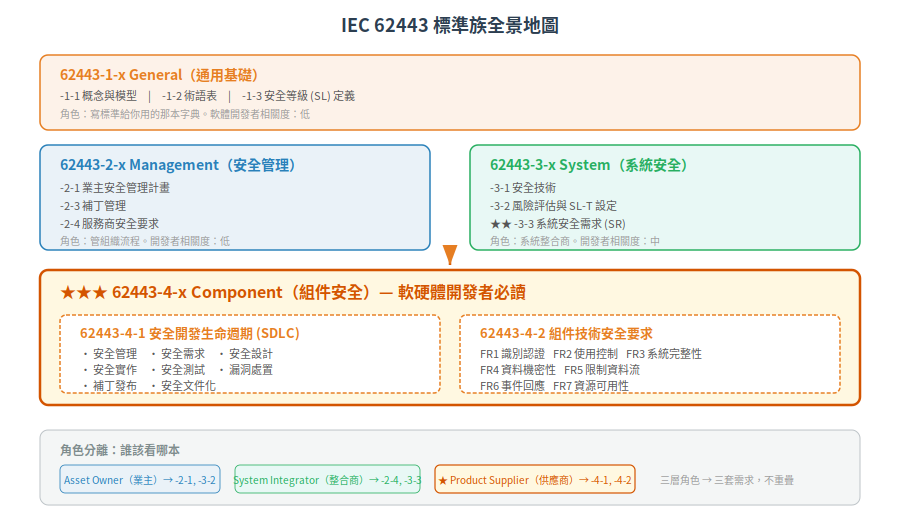

# IEC 62443 全景圖 — 為什麼 OT 需要獨立的資安標準

> 一句話定位：IEC 62443 不是「IT 資安搬到工廠」，而是從 **可用性/安全先於機密性、10-20 年生命週期、不能隨便重開機** 這三條物理現實逼出的獨立體系。本篇從根本問題推導為何工控系統（IACS）需要自己的資安標準、標準族全景、以及軟硬體開發者該看哪幾本。
>
> 前置：無。這是知識庫的起點。
> 下一篇：[Zone & Conduit — 信任邊界的根本推導](02-zone-and-conduit.md)

## 1. 根本問題：兩個世界的碰撞

### 場景

把問題剝乾淨。一個半導體廠裡：
- 有一群 PLC 控制閥門/溫度/壓力——**不能停**，停了 = 整批晶圓報廢
- 有一群 AMR（自主搬運車）載著晶圓盒跑——**不能撞**，撞了 = 人受傷、料報廢
- 有一群工程師遠端監看、調參數、下搬運任務——**不能錯**，錯了 = 送錯站點

這些東西全部連在網路上。問一個最根本的問題：

> **能把 IT 那套資安標準直接搬過來嗎？**

### 1.1 第一條裂縫：優先序倒過來了

IT 世界的資安鐵三角 (CIA triad)：

| 面向 | IT 系統 | 工控 (OT) 系統 |
|---|---|---|
| **機密性 (C)** | ★★ 第一優先（資料不能外洩，GDPR 罰很重） | ★ 重要但不是第一 |
| **完整性 (I)** | ★★ 與機密性並列 | ★★ 關鍵（參數被改 = 閥門開錯 = 爆炸） |
| **可用性 (A)** | ★ 重要但可容忍 downtime（重開機、打 patch） | ★★★ **第一優先**（產線不能停、車不能不動） |

IT 是 **CIA**。OT 是 **AIC**。

這不是偏好，是物理現實：
- IT 伺服器當機 = 網頁 500 = 消費者等一下，不開心但不會死人
- OT 控制系統當機 = 閥門不關 = 過熱爆炸 / AMR 不減速 = 撞人

**根本問題**：ISO 27001 這類 IT 資安標準把「機密性」放在最前面——它假設組織可以接受「先關機再修補」。工控做不到。

### 1.2 第二條裂縫：時間尺度不同

| 時間面向 | IT | OT |
|---|---|---|
| 系統生命週期 | 3-5 年換代 | **10-20 年**（PLC/變頻器一裝就是十年） |
| 補丁頻率 | 每月 Patch Tuesday | **一年一次排程停機**，或更少 |
| 重開機成本 | 幾分鐘、自動化 | **數小時、須現場人員、有安全程序** |
| Legacy 存在 | 不鼓勵但可忍受 | **常態**：Windows NT 還在跑產線不是笑話 |

第二個根本衝突：IT 的安全模型假設「有洞就補」，工控的物理現實逼迫「不能隨便補」。

### 1.3 第三條裂縫：後果不是資料損失，是物理傷害

| 後果類型 | IT | OT |
|---|---|---|
| 資料外洩 | 罰款、名譽損失 | 配方/參數外洩 → 競爭、合規風險 |
| 服務中斷 | 營收損失 | **停產損失**（半導體廠一小時數百萬美金） |
| 系統被控 | 勒索贖金 | **勒索 + 物理破壞**（改參數損壞設備、過壓過溫爆炸） |
| 安全 | N/A | **人身安全**（閥門失控、機器手臂誤動作、AMR 撞人） |

這三條裂縫（優先序反轉、時間尺度差異、物理後果）不是 IEC 62443 「發明」的，而是它 **回應**的現實。讓我們看一個讓全世界被迫面對這些裂縫的事件。

## 2. 轉捩點：Stuxnet (2010)

2010 年發現的 Stuxnet 蠕蟲是工控資安的 watershed moment。它不只是一隻病毒，而是一個精準的物理攻擊武器：

- **目標**：伊朗 Natanz 鈾濃縮廠的特定型號 PLC（Siemens S7-300）+ 特定型號變頻器
- **手段**：四枚 Windows 零時差漏洞 + 兩家憑證被竊（Realtek、JMicron）+ 特製 PLC rootkit
- **效果**：週期性「加速→減速→加速→減速」讓離心機轉子承受非設計應力，慢慢破壞，同時篡改監控畫面讓操作員看到「一切正常」
- **傳播**：透過 USB 跳過 air-gap，在隔離網路內擴散

Stuxnet 讓資安界意識到三件事：

1. **IT 安全保證不了 OT 安全**——目標不是偷資料，是破壞實體設備
2. **Air-gap（實體隔離）不是銀彈**——照樣被跳過
3. **工控設備本身沒有自保能力**——PLC「被改程式」這件事，當時沒有完整性校驗、沒有簽章驗證、沒有異常偵測

正是在這個背景下，ISA-99（2002 啟動，後成為 IEC 62443 [^1]）系列加速制定——它不是拍腦袋想的，是被現實逼出來的。

[^1]: ISA-99 工作組於 2002 年由 ISA (International Society of Automation) 成立，2007 年起 ISA-99 標準陸續被採納為 IEC 62443 系列。參見 [ISA 官網](https://www.isa.org/standards-and-publications/isa-standards/isa-99)。

## 3. IEC 62443 的解法架構

從前面三個根本衝突，IEC 62443 的回答是三層：

### 3.1 角色分離（誰負責什麼）

不像 IT 標準假設「一個組織管所有東西」，工控的現實是多方角色共構一個系統：

| 角色 | 責任 | 對應標準 |
|---|---|---|
| **Asset Owner**（業主） | 定義安全需求、執行風險評估、營運安全 | -2-1、-3-2 |
| **System Integrator**（系統整合商） | 把組件兜成系統、確保系統滿足 SL-T | -2-4、-3-3 |
| **Product Supplier**（產品供應商） | 把產品安全地開發出來、讓組件具備 SL-C | **-4-1、-4-2** |

這層角色分離是關鍵：**軟硬體開發者（Product Supplier）的責任是讓組件「有達到 SL-C 的能力」，但「要達到哪個 SL」是 Asset Owner 根據自身風險決定的。**

### 3.2 分層防禦（從系統到組件）

IEC 62443 不假設「單一神藥」能解決所有問題。它把安全需求切成兩層：

- **系統層（3-3）**：系統作為整體的安全需求（System Requirements，SR）。例：「控制網路與企業網路之間要有防火牆」
- **組件層（4-2）**：每個組件自己要有的安全能力（Component Requirements，CR）。例：「PLC 本身要支援憑證認證」

關鍵洞見：**系統層做不到的，組件要補；組件做不到的，系統層要補。**

這就是 CCSC 2（Common Component Security Constraint #2）的鐵律：
> 組件無法自行滿足的技術需求，可由系統層級補償對策滿足——但必須記載於組件文件中。

舉例：一台舊型 PLC 不支援 TLS 加密通訊→不需要換掉它（等於從頭建廠），而是在 Conduit 上做 VPN 加密——系統層補償。但文件必須寫明「本組件不支援傳輸加密」。

### 3.3 全生命週期（不只產品，還有開發流程）

IEC 62443 定義的不只「產品長怎樣」（4-2），還有「產品怎麼做出來」（4-1）：

- **4-1 安全開發生命週期（SDLC）**：威脅建模、安全編碼、安全測試、漏洞管理、補丁發布
- **4-2 組件技術安全要求**：識別、認證、授權、加密、完整性、稽核、可用性

**為什麼開發流程也要管？** 因為一個用正確流程開發的產品，出漏洞時你知道去哪裡修、修多久、怎麼通知客戶。一個用 ad hoc 流程開發的產品，連自己用了哪個有 CVE 的相依庫都不知道。

## 4. 標準族全景地圖

IEC 62443 分四群。以下用一張地圖說明每群管什麼、誰該讀：

| 群 | 涵蓋 Part | 管什麼 | 軟硬體開發者相關度 |
|---|---|---|---|
| **62443-1-x** General | -1-1 (概念模型)、-1-2 (術語)、-1-3 (SL 定義) | 定義共同的語言、模型、安全等級 | 低：當字典用 |
| **62443-2-x** Management | -2-1 (業主)、-2-3 (補丁)、-2-4 (服務商) | 組織管理流程、人員要求、政策 | 低：理解角色即可 |
| **62443-3-x** System | -3-1 (技術)、-3-2 (風險評估)、**-3-3 (系統要求)** | 系統層安全需求與風險評估方法 | **中**：了解你的組件要處理哪些系統層需求 |
| **62443-4-x** Component | **-4-1 (安全開發)**、**-4-2 (組件技術要求)** | 組件的安全開發流程與技術能力 | **★★★ 最高**：這就是寫給你的 |

**軟硬體開發者只需深刻掌握 -4-1 和 -4-2。** 其餘的理解到「知道在講什麼」即可。

## 5. 軟硬體開發者的 10 秒速覽

如果你只能記三件事，記這三件：

| # | 核心洞見 | 出處 |
|---|---|---|
| 1 | 產品的開發流程必須安全——不是「事後補」，是「從需求開始就納入安全」 | -4-1 |
| 2 | 產品本身要具備 7 類安全能力（識別/授權/完整性/加密/資料流/稽核/可用性），分 SL 1-4 四種防護強度（外加 SL 0 無需求） | -4-2 |
| 3 | 做不到的不一定要硬做——系統層或 Conduit 可以補償，但必須**寫清楚**（CCSC 2，四條 CCSC 見 [CONTEXT.md](../../CONTEXT.md)） | CCSC 2 |

## 6. 下一篇

理解了「為什麼 OT 要有自己的資安標準」之後，下一個問題：**在一個工廠裡，信任邊界怎麼劃？** → [Zone & Conduit — 信任邊界的根本推導](02-zone-and-conduit.md)

---

相關：[CONTEXT.md](../../CONTEXT.md)、[PLAN.md](../../PLAN.md)、[IEC 62443-1-1 (概念模型) 官方頁](https://webstore.iec.ch/en/publication/7029)

---

## 本文使用縮寫對照

| 縮寫 | 全稱 | 說明 |
|---|---|---|
| **AMR** | Autonomous Mobile Robot | 自主移動機器人/搬運車 |
| **CCSC** | Common Component Security Constraint | 通用組件安全約束，4-2 定義 4 條鐵律 |
| **CR** | Component Requirement | 組件安全需求，IEC 62443-4-2 定義 |
| **CVE** | Common Vulnerabilities and Exposures | 通用漏洞揭露編號 |
| **IACS** | Industrial Automation and Control System | 工業自動化與控制系統，IEC 62443 的守備範圍 |
| **PLC** | Programmable Logic Controller | 可程式邏輯控制器 |
| **SDLC** | Secure Development Lifecycle | 安全開發生命週期，IEC 62443-4-1 規範 |
| **SL** | Security Level | 安全等級，依攻擊者能力分 0-4 級 |
| **SL-C** | Capability Security Level | 能力安全等級，組件或系統能達到的安全等級 |
| **SL-T** | Target Security Level | 目標安全等級，業主經風險評估後設定 |
| **SR** | System Requirement | 系統安全需求，IEC 62443-3-3 定義 |
| **TLS** | Transport Layer Security | 傳輸層安全協定，加密通訊 |

> 完整術語表見 [CONTEXT.md](../../CONTEXT.md)
