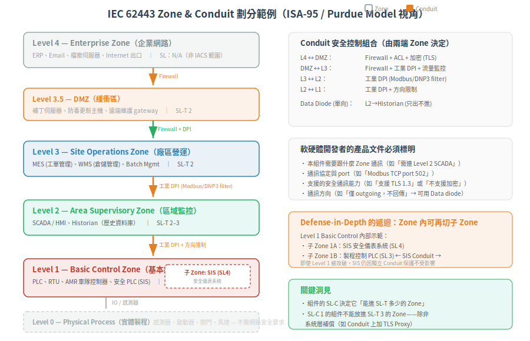

# Zone & Conduit — 信任邊界的根本推導

> 一句話定位：Zone & Conduit 是 IEC 62443 的空間模型——回答「在一個工廠裡，信任邊界該劃在哪裡、區與區之間的通訊怎麼控管」。它不只是一張網路架構圖，而是從「一個平面網路被攻破一點就全倒」這個根本缺陷逼出來的必然解法。
>
> 前置：[IEC 62443 全景圖](01-iec62443-overview.md)（理解 OT 資安的根本問題）
> 下一篇：[Security Levels — SL-T/SL-C/SL-A 三角](03-security-levels.md)

## 1. 根本問題：為什麼不能全部放在同一個網路？

### 場景

一個典型的半導體廠網路：

```
  <p align="center"></p>```

所有東西在同一層 L2/L3 網路。ARP 廣播看得到彼此、TCP port 能通就通。

**根本缺陷**：攻擊者只需要一個入口——一台工程師筆電被釣魚、一台 CCTV 有預設密碼、一台 PLC 的 firmware 有已知漏洞——就能橫向移動到整個網路的任何設備。一個點 = 全場投降。

### 為什麼企業網路不能這樣搞？

IT 世界早就解決了這個問題：DMZ、VLAN、防火牆規則、zero-trust network。但 IT 的解不能直接搬進 OT，因為：

- **PLC 不跑防毒**——它是一顆微控制器，沒有 agent-based EDR
- **工業協定不支援 TLS**——Modbus TCP 裸奔，EtherNet/IP 的 CIP Security 是新東西、舊設備不支援
- **不能裝 patch**——見上一篇的生命週期問題

所以 OT 需要的不是「在每個端點做安全」（做不了），而是 **在網路邊界做安全**——把不同信任等級的設備物理/邏輯隔離，在區與區之間放置安全控制。

這就是 Zone & Conduit 的根本動機。

### 1.1 思考實驗：從根本問題推出解法

讓我們用第一性原理推導，而非背模型：

1. **事實**：有些設備控制的是物理世界（閥門、馬達、AMR），搞砸會死人；有些設備只是看監視器、跑報表，搞砸不會死人
2. **推論一**：這些設備的「安全後果」不同 → **信任等級不同**
3. **推論二**：如果把信任等級不同的東西放在同一張網路，駭客的橫向移動成本趨近於零
4. **推論三**：要增加橫向移動成本，唯一的方法是在兩群之間放一個可控的瓶頸——一個「除非通過審查，否則不能通」的點
5. **必然解**：(a) 把同信任等級的設備歸成 **Zone**；(b) Zone 之間只允許透過 **Conduit** 通訊；(c) Conduit 上實作安全控制（認證、過濾、加密）

這不是 IEC 62443 的發明。這是 defense-in-depth 在網路層的具體化。

## 2. Zone：信任邊界

### 2.1 Zone 的定義

> **Zone**：將系統中具有共同安全需求的資產（實體或邏輯）分組。每個 Zone 有自己的安全等級 (SL-T) 需求，Zone 之間由 Conduit 連接。

拆開來看：

| 屬性 | 說明 |
|---|---|
| 共同安全需求 | 同一 Zone 內的資產面對相同的威脅等級、需要相同強度的防護 |
| 實體或邏輯 | 可以靠實體隔離（獨立機櫃、獨立交換機），也可以靠邏輯隔離（VLAN） |
| 自有 SL-T | 每個 Zone 獨立設定目標安全等級（SL-T），不必全廠統一 |
| 有邊界 | Zone 有「裡面 vs 外面」的明確邊界，所有跨邊界的流量必須經過 Conduit |

### 2.2 典型 Zone 劃分（ISA-95 / Purdue Model 視角）

從 ISA-95 企業整合模型衍生，常見的 Zone 層級（由安全到不安全）：

| Level | 名稱 | 典型資產 | 信任等級 | 典型 SL-T |
|---|---|---|---|---|
| Level 0 | **實體製程 (Physical Process)** | 感測器、致動器、馬達 | 不需網路安全（但需實體安全） | — |
| Level 1 | **基本控制 (Basic Control)** | PLC、RTU、DCS 控制器 | **最高信任** | SL 3-4 |
| Level 2 | **區域監控 (Area Supervisory)** | HMI、SCADA、Historian | 高信任 | SL 2-3 |
| Level 3 | **廠區營運 (Site Operations)** | MES、Batch Mgmt | 中信任 | SL 2 |
| Level 3.5 | **DMZ** | Patch server、AV server、Remote access | **邊界緩衝** | SL 2 |
| Level 4 | **企業網路 (Enterprise)** | ERP、Email、Internet | 低信任（IT standard） | N/A |

> Level 0 不是網路設備，不直接適用 IEC 62443 的網路安全要求，但 Level 1 控制 Level 0 的設備，所以 Level 1 的安全性直接影響物理世界安全。

### 2.3 Zone 劃分的兩個核心問題

**問題一**：同一個 Zone 內的設備可以彼此信任嗎？

可以——但前提是它們面對相同的威脅、有相同等級的安全控制。如果一台 Level 2 的 HMI 和一台 Level 1 的 PLC 被塞進同一個 Zone，那攻擊 HMI（通常跑 Windows、有更多攻擊面）就等於拿到 PLC 的控制權。

**問題二**：Zone 可以再切分子 Zone 嗎？

可以。這叫 defense-in-depth 的遞迴應用。例如「Level 1 基本控制 Zone」可能再切成：
- 子 Zone 1A：安全儀表系統 (SIS) — SL 4（即使一切失控也要能安全停機）
- 子 Zone 1B：製程控制 PLC — SL 3
- 兩者之間有 Conduit

## 3. Conduit：受控的通道

### 3.1 Conduit 的定義

> **Conduit**：連接兩個或更多 Zone 的通訊通道，提供安全功能以保護穿越該通道的資料，並允許不同 Security Level 的 Zone 安全共存。

關鍵詞：**安全共存**。兩個 SL-T 不同的 Zone 要通訊，Conduit 負責確保「低信任 Zone 不能透過通道攻擊高信任 Zone」。

### 3.2 Conduit 上長什麼？

Conduit 不是一個具體的產品，它是一個安全功能的組合：

| 安全功能 | 說明 | 實作範例 |
|---|---|---|
| **存取控制** | 只允許合法的通訊（IP/source/destination/protocol whitelist） | Firewall ACL、工業協定 DPI |
| **認證** | 通訊雙方互相驗證身分 | 憑證雙向認證、PSK |
| **加密** | 保護傳輸內容不被竊聽或篡改 | TLS、IPsec、MACsec |
| **流量監控** | 記錄誰對誰發了什麼（安全事件記錄） | NetFlow、IDS 簽章 |
| **方向限制** | 只允許單向通訊（防止外洩/注入） | Data diode |

### 3.3 Conduit 的種類

| 型態 | 說明 | 典型場景 |
|---|---|---|
| **防火牆 + ACL** | 最常見：L3-L4 過濾 | Level 3 ↔ Level 4 DMZ |
| **工業 DPI** | L7 應用層辨識 Modbus/DNP3/EtherNet/IP 指令 | Level 1 PLC ↔ Level 2 SCADA |
| **Data Diode** | 純單向（光電轉換，物理保證不回傳） | Level 2 → Level 3.5 (historian 只出不進) |
| **VPN / 加密通道** | 跨 WAN 或遠端存取 | Remote maintenance ↔ DMZ |

> Data diode 是一個很有意思的極端案例：它以物理方式保證資料只能單向流動（Tx 端是 LED、Rx 端是 photodiode，沒有反向通道）。這用於「高安全 Zone 要把資料送給低安全 Zone，但絕對不准低安全 Zone 發任何東西進高安全 Zone」的場景。

## 4. 實際操作：怎麼劃分 Zone & Conduit

IEC 62443-3-2 定義了標準化的步驟：

### 步驟 1：定義 SUC (System Under Consideration)

先把「這次評估的範圍」畫出來。不用一次搞全廠，可以分期——先從 Level 1-2（控制層）開始。

### 步驟 2：識別資產 (Inventory)

列出範圍內每一台設備：
- 型號、韌體版本
- 通訊能力（支援什麼協定）
- 安全後果（這台被控會怎樣？）

### 步驟 3：劃分 Zone

把設備按以下原則分組：
- 相同的功能角色（控制 vs 監控 vs 營運）
- 相同的安全後果（停線 vs 資料損失 vs 不痛）
- 相同的通訊需求（哪些設備需要跟哪些設備講話）

### 步驟 4：定義 Conduit

對每個 Zone 對 (A↔B)，標出：
- 需要通什麼協定、哪個 direction
- 需要什麼安全控制（這取決於兩區的 SL-T 差異，見下篇）
- 無法在 Conduit 上滿足的安全需求，能否在端點補償

### 步驟 5：分配 SL-T

對每個 Zone 和每個 Conduit 執行風險評估（見 -3-2），定出 SL-T。這一步直接決定後續選組件的邏輯。

<p align="center"></p>

## 5. 軟硬體開發者要知道的事

Zone & Conduit 模型對產品開發者的影響，不是「你要實作 Conduit」，而是：

| 開發者面向 | 影響 |
|---|---|
| **你的產品是一個組件** | 你產品的 SL-C 會決定它能被放進 SL-T 多少的 Zone。SL-C 1 的組件放進 SL-T 3 的 Zone 時，必須有系統層補償（CCSC 2），並記載於組件文件中。 |
| **你的產品的通訊需求** | 產品文件要寫清楚「需要跟什麼通，用什麼協定」，這直接影響 Conduit design——整合商必須知道你會開哪些 port |
| **你的產品的限制** | 產品做不到的安全功能（如不支援 TLS）必須文件化，讓整合商可以在 Conduit 上補償——這就是 CCSC 2 的實踐 |
| **你的產品的通訊方向** | 如果產品只發送資料（如 sensor），寫明「只 outgoing」可以幫助整合商選 Data diode Conduit |

## 6. 小結

- Zone = 同信任等級的資產群組（因為平面網路一個洞全死，必須切）
- Conduit = Zone 之間唯一的通道，上面堆安全控制
- Defense-in-depth = 多層 Zone + 多層 Conduit
- 每個 Zone 有自己的 SL-T（見下篇），Conduit 的強度由兩端 Zone 的安全需求決定

## 7. 下一篇

劃好 Zone 之後，下一個問題：**每個 Zone 要防到多強？SL1-4 怎麼定義？SL-T、SL-C、SL-A 三者什麼關係？** → [Security Levels — SL-T/SL-C/SL-A 三角](03-security-levels.md)

---

相關：[CONTEXT.md](../../CONTEXT.md)、[IEC 62443-3-2 官方頁](https://webstore.iec.ch/en/publication/30727)
