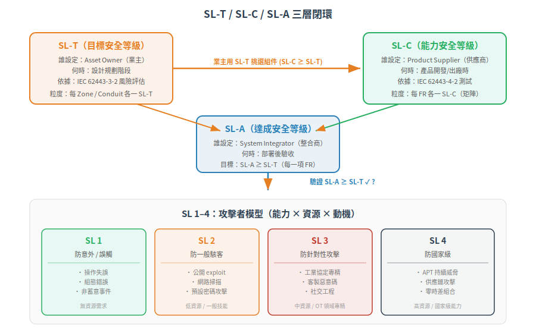

# Security Levels (SL) — SL-T / SL-C / SL-A 三角與威脅模型

> 一句話定位：Security Level 回答「**要防到多強**」——不是一個泛泛的「高/中/低」，而是按攻擊者的能力/資源/動機分成 4 級，再透過 SL-T / SL-C / SL-A 三層模型把風險評估→產品選型→部署驗收串成閉環。
>
> 前置：[Zone & Conduit](02-zone-and-conduit.md)（理解信任邊界後，每個 Zone 要定 SL-T）
> 下一篇：[FR 1-7 全景](04-foundational-requirements.md)（SL 落實到具體的 7 個基礎安全需求）

## 1. 根本問題：「夠安全」是多安全？

每個安全設計都撞到同一個牆：**沒有絕對安全，只有相對於對手的強度。**

你不需要防核彈來鎖腳踏車。同理，控制一座發電廠的 PLC 和控制你家陽台 LED 燈的 ESP32 不必做到一樣的安全強度。

IT 的「H/M/L」三分法（high/medium/low）太模糊。「高」到底是防腳本小子還是防國家級？不同整合商對「高」的定義不同 → 產品供應商不知道要做到什麼程度 → 業主買了「號稱高安全」產品發現擋不住針對性攻擊。

IEC 62443 的回答：**用攻擊者模型代替主觀評級。**

## 2. SL 1–4：攻擊者能力 × 資源 × 動機

### 2.1 四級定義

| SL | 防範對象 | 攻擊者特徵 | 代表性威脅 |
|---|---|---|---|
| **SL 0** | 無 | 無安全需求 | — |
| **SL 1** | 意外/誤觸 | 無蓄意攻擊；操作失誤、組態錯誤、軟體 bug | 工程師不小心改了閾值；設備預設密碼被無意撞見 |
| **SL 2** | 一般駭客 | **蓄意**，但手段簡單、資源少、技能一般、動機低 | 網路掃描 + default password login；公開 exploit 腳本 |
| **SL 3** | 針對性攻擊 | 蓄意，複雜手段、中等資源、**OT 領域專精**、中等動機 | 專責團隊，了解工業協定 (Modbus/EtherNet/IP)；客製化惡意碼；social engineering 含物理入侵 |
| **SL 4** | 國家級 | 蓄意，複雜手段、**大量資源**、OT 領域專精、高動機 | APT（進階持續性威脅）、供應鏈攻擊、零時差漏洞組合攻擊；Stuxnet 等級 |

### 2.2 為什麼用攻擊者模型而不是技術規格？

**第一性原理推導**：

1. 「安全」是一個相對概念，必須有參照對象
2. 最合理的參照對象是「誰會來攻擊你」——因為防護的強度取決於對手的強度
3. 直接問攻擊者能力（能力/資源/動機）比列技術規格更本質——技術規格會過時，攻擊者模型相對穩定

| 技術規格法 (錯) | 攻擊者模型法 (對) |
|---|---|
| 「要支援 AES-256」 | SL 3 的攻擊者不是靠破 AES-256，是靠偷你的金鑰 / 釣魚你的員工 |
| 「要有防火牆」 | SL 2 防腳本小子，能用 ACL 擋住掃描即可；SL 4 要防供應鏈攻擊，防火牆沒用 |

**關鍵洞見**：SL 分級問的不是「你有什麼安全功能」，而是「你擋得住哪一級的攻擊者」。同樣一個 FR（例如 FR1 識別與鑑別），SL 1 可能只要帳密不重複，SL 3 就要求多因素認證 + 硬體安全模組。

## 3. SL-T / SL-C / SL-A：安全等級的三層閉環

只定義 SL 1-4 不夠，因為「誰說了算」有歧義：
- 業主說「我要 SL 3」→ 但你有沒有達到 SL 3？
- 供應商說「我產品 SL 3」→ 但你真的防得住 SL 3 的攻擊者？

IEC 62443 把安全等級拆成三層，每一層由不同角色負責：

### 3.1 三層模型

| 縮寫 | 全稱 | 中文 | 誰定義 | 什麼時候 |
|---|---|---|---|---|
| **SL-T** | Target Security Level | 目標安全等級 | **Asset Owner**（業主）透過風險評估 (-3-2) | 設計階段：對每個 Zone/Conduit 設定 |
| **SL-C** | Capability Security Level | 能力安全等級 | **Product Supplier**（供應商）透過開發與測試 (-4-1/-4-2) | 開發階段：產品出廠時宣告 |
| **SL-A** | Achieved Security Level | 達成安全等級 | **System Integrator**（整合商）整合後評估 | 部署後：實際量測確認達到 SL-T |

### 3.2 閉環邏輯

一個完整的遵循週期：

1. **業主**執行風險評估 (-3-2)：把我的工廠根據 Zone/Conduit 模型切分，每個 Zone 與 Conduit 評估「最大敵人是誰」→ 定出各 Zone/Conduit 的 SL-T
2. **業主/整合商**採購組件時：檢查供應商的 SL-C 宣告——對每個 FR，組件能做到 SL-C 幾？
3. **整合商**部署後：實際測試確認整合後的 SL-A 大於等於 SL-T
4. 若 SL-A < SL-T：不是缺——需要補償對策 (compensating countermeasures) 或換組件

### 3.3 SL-C 的宣告粒度

重要：一個組件的 SL-C **不是一個數字**，而是一張矩陣：

| FR | SL-C |
|---|---|
| FR1 (IAC) | 3 |
| FR2 (UC) | 2 |
| FR3 (SI) | 3 |
| FR4 (DC) | 2 |
| FR5 (RDF) | 1 |
| FR6 (TRE) | 2 |
| FR7 (RA) | 2 |

也就是說，一個產品可以 **FR1 做到 SL 3、FR4 只做到 SL 2**。這很正常——有些產品先天不處理機密資料，不需要 SL 3 的加密。

**對業主的意義**：買產品時不是看「這台 PLC 是 SL 幾」，而是看它的 SL-C 矩陣是否每一項都 ≥ 你 Zone 的 SL-T 矩陣。某項不足 = 需要系統層補償。

## 4. 實例：一個 AMR 場域的 SL-T 設定

用搬運車場域做實際推演：

### 4.1 Zone 劃分與風險評估

| Zone | 資產 | 最壞情況 | 預期攻擊者 | SL-T |
|---|---|---|---|---|
| 企業區 (L4) | ERP、Email | 機密外洩、勒索 | 一般駭客 | N/A (IT) |
| DMZ (L3.5) | 遠端維護、補丁 | 遠端入侵跳板 | 一般/針對性 | SL 2 |
| 營運區 (L3) | MES/WMS | 工單亂發、停線 | 針對性（內鬼/競爭者） | SL 2 |
| 監控區 (L2) | SCADA/iMEC | 篡改搬運任務、撞車 | 針對性（知道系統架構者） | **SL 3** |
| 控制區 (L1) | AMR 控制器、PLC | 車失控撞人 | 針對性 + 物理接近 | **SL 3** |
| 安全子區 (L1-SIS) | 安全 PLC | 安全功能失效 | 國家級 / 供應鏈 | **SL 4** |

### 4.2 挑選組件（SL-C ≥ SL-T）

以 L1 控制區 (SL-T = 3) 為例，挑選一台 AMR 控制器：

| FR | Zone SL-T | 產品 SL-C | 是否滿足 |
|---|---|---|---|
| FR1 (IAC) | 3 | 3 (支援 MFA + 憑證) | ✓ |
| FR2 (UC) | 3 | 2 (只有 RBAC，無稽核軌跡) | ✗ → 需補償 |
| FR3 (SI) | 3 | 3 (Secure Boot + 簽章更新) | ✓ |
| FR4 (DC) | 2 | 2 (TLS 1.3) | ✓ |
| FR5 (RDF) | 2 | 1 (無 DPI 支援) | ✗ → Conduit 補償 |
| FR6 (TRE) | 2 | 2 (syslog + SIEM) | ✓ |
| FR7 (RA) | 2 | 2 (fail-safe) | ✓ |

> FR2 和 FR5 不滿足，但不代表不能用——整合商在 Conduit 和系統層補償（例如在 Conduit 上做額外的授權檢查、在 Zone 邊界加 DPI 防火牆）。這就是 CCSC 2 在實務上的操作。

## 5. SL 與 FR 的關係（預告下篇）

SL 定義「強度」，FR 定義「什麼要安全」。兩者的關係是：

- **FR** = 安全的面向（你要保護什麼？Auth？加密？完整性？）
- **SL** = 每個面向要做到什麼程度（防一般駭客？還是防國家級？）
- 所以一個完整的 4-2 需求是：「FR1 (IAC) 要做到 SL-C 3」，而不只是「要做認證」

下一篇會展開每個 FR 的根本問題、在各 SL 等級的差異。

## 6. 小結

- SL 1-4 = 攻擊者模型的量化（能力 × 資源 × 動機），不是主觀評級
- SL-T / SL-C / SL-A = 三層閉環：業主設定目標 → 供應商宣告能力 → 整合商驗證達成
- 一個產品的 SL-C **不是一個數字**，而是每個 FR 獨立宣告
- 某 FR 的 SL-C < SL-T 時，可以用系統層補償（CCSC 2）

## 7. 下一篇

理解了「要防到多強 (SL)」之後，下一個問題：**安全要顧哪些面向？FR 1-7 到底是哪七個？他們從哪個根本問題推導出來？** → [FR 1-7 全景 — 七個基礎安全需求的由來](04-foundational-requirements.md)

---

相關：[CONTEXT.md](../../CONTEXT.md)、[IEC 62443-3-2 (風險評估與 SL 定義) 官方頁](https://webstore.iec.ch/en/publication/30727)
