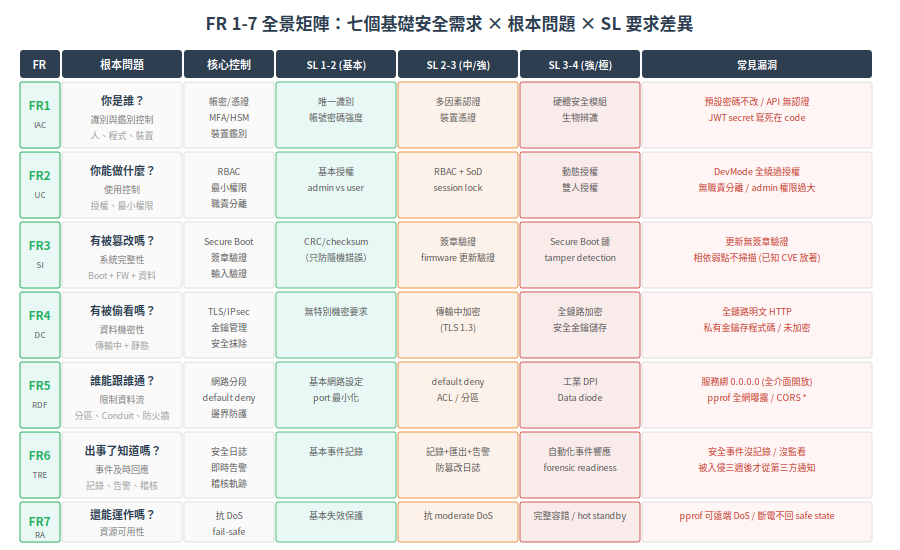

# FR 1-7 全景 — 七個基礎安全需求的由來

> 一句話定位：FR (Foundational Requirements) 是 IEC 62443 的骨架——把「工控系統安全」這個模糊的概念拆成七個具體的面向。本篇從根本問題推導：**為什麼是這七個？它們各自回答什麼問題？** 不背條文，先重建它們存在的必然性。
>
> 前置：[Security Levels](03-security-levels.md)（理解每個 FR 在不同 SL 要做多強）
> 下一篇：[FR 1 (IAC)：識別與鑑別控制](../03-component-fr/02-fr1-identification-authentication.md)（撰寫中，進入組件層第一條 FR 的深度解說）

## 1. 根本問題：「安全」到底是什麼？

「這台 PLC 安全嗎？」——這個問題無法回答，因為「安全」不一個維度。

把它拆開。一台工控組件（PLC、RTU、AMR 控制器）在運行時，會發生以下 7 種根本性威脅。IEC 62443 把每一種對應成一條 FR：

### 根本威脅 → FR 對照

| # | 根本威脅 | 對應 FR | 縮寫 | 要問的問題 |
|---|---|---|---|---|
| 1 | 你不知道誰在操作它 | FR 1 | IAC | 你是誰？我怎麼確認？ |
| 2 | 任何人都能做任何事 | FR 2 | UC | 你被允許做什麼？ |
| 3 | 程式/資料被偷改但你不知道 | FR 3 | SI | 程式有沒有被篡改？ |
| 4 | 機密資料被偷看 | FR 4 | DC | 資料有沒有被偷看？ |
| 5 | 網路誰都能跟誰通 | FR 5 | RDF | 誰能跟誰通？ |
| 6 | 出事了你不知道 | FR 6 | TRE | 出事了我知道嗎？ |
| 7 | 被打/自己壞了就停擺 | FR 7 | RA | 還能繼續運作嗎？ |

**第一個洞見**：這七條是互補的，沒有重疊。每一條回答一個獨立的問題，缺一條就是一個漏洞類別。這不是「列出常見安全功能」的結果，而是對「什麼構成安全」的完整分解。

**第二個洞見**：這七條是一個閉環。如果你只有 FR1（知道誰在操作）但沒有 FR6（出了事你不知道），你只是在日誌裡看到「Unknown 使用者做了 Unknown 操作」——有用嗎？FR 之間必須全覆蓋才有意義。

## 2. 逐條推導

### 2.1 FR 1 — IAC (Identification and Authentication Control)：你是誰？

**根本問題**：一指令下來——「緊急停止」「改參數」「刪除任務」——系統必須知道**這指令是誰發的**，以及**這個人/程式/裝置是不是他宣稱的那個人**。

**為什麼不是只有「人類使用者」？** 工控環境中，發出指令的不只人：

| 主體類型 | 範例 | 需要 IAC？ |
|---|---|---|
| 人類使用者 | 工程師登入 HMI 改參數 | ✓ 帳號密碼、MFA、生物辨識 |
| 軟體程序 | MES 自動發工單給 PLC | ✓ 服務帳號、API key、憑證 |
| 其他裝置 | 一台 PLC 跟另一台 PLC 交換資料 | ✓ 裝置憑證、PSK |

所以 FR1 涵蓋 **三個層級的主體識別**：人、程序、裝置。這在 FR 中是最基礎的一條——如果你不知道對面是誰，之後所有的控制都是建立在沙上。

**SL 1-4 的差異**：
- SL 1：唯一識別，不需要鑑別（知道是「操作員 A」，但不嚴格驗證）
- SL 2：帳號密碼，一般強度的鑑別
- SL 3：多因素認證 (MFA)、裝置憑證、防 replay
- SL 4：硬體安全模組 (HSM) 保護的鑑別、生物辨識、anti-spoofing

### 2.2 FR 2 — UC (Use Control)：你被允許做什麼？

**根本問題**：鑑別完「你是誰」之後，下一件事是「你能做什麼」。一個實習生不該有權停掉全廠的 PLC。

**最小權限 (Least Privilege)** 是 FR2 的核心原則——每個人/程序/裝置只拿到他完成任務所需的最少權限。但為什麼在工控特別難做？

| IT 的 RBAC | OT 的困難 |
|---|---|
| 角色明確 (admin / user / auditor) | 角色模糊：同一人早上是操作員、下午是維修員、半夜是值班主管 |
| 權限穩定 | 權限隨產線狀態變：正常運轉鎖一切 / 維修模式開放更多 |
| 變更可控 | 變更 = 停產風險：授權邏輯改了但沒測→意外阻擋正確操作→停線 |

**SL 1-4 的差異**：
- SL 1：基本的權限分離（如 admin vs user）
- SL 2：RBAC、最小權限
- SL 3：職責分離 (SoD)、含稽核軌跡的使用控制、session lock
- SL 4：動態授權（依環境/時間/系統狀態調整權限）、雙人授權 (two-person rule)

### 2.3 FR 3 — SI (System Integrity)：程式有沒有被篡改？

**根本問題**：你怎麼知道現在執行的 firmware 是原廠給的，還是被注入後門的版本？你怎麼知道 PLC 的參數表沒被偷改一個位元？

系統完整性有三個層級：

| 層級 | 保護對象 | 機制 |
|---|---|---|
| **開機完整性** | Bootloader / FW | Secure Boot（簽章驗證鏈）、root of trust |
| **運行完整性** | 執行中的程式/參數 | 記憶體保護、execute-only memory、runtime integrity check |
| **傳輸/儲存完整性** | 更新檔、日誌、備份 | 數位簽章、HMAC、CRC（不夠！CRC 只防隨機錯誤不防蓄意） |

**區分 CRC 與 HMAC/簽章：這是個常見陷阱。**
- CRC 保證「傳輸過程中 bit 沒被雜訊 flip」→ 防隨機錯誤
- HMAC/簽章保證「內容沒被有心人修改」→ 防蓄意攻擊

對工控系統，**CRC 不夠**——因為攻擊者可以重算 CRC。

**SL 1-4 的差異**：
- SL 1：CRC / checksum（只防意外）
- SL 2：簽章驗證（防蓄意篡改）
- SL 3：Secure Boot（完整信任鏈）+ firmware 反回滾
- SL 4：硬體 root of trust + tamper detection + 自動復原

### 2.4 FR 4 — DC (Data Confidentiality)：資料有沒有被偷看？

**根本問題**：控制網路上的通訊，有沒有被第三者竊聽？儲存在設備裡的配方、參數、憑證，有沒有被未授權者讀取？

很多人說「OT 資料又不值錢，為什麼要加密？」——錯的。

| OT 機密資料 | 洩漏後果 |
|---|---|
| 製程參數（溫度曲線、壓力設定） | 競爭者複製製程、品質參數 |
| 生產排程良率 | 內線交易、商業間諜 |
| 認證金鑰 / 憑證私鑰 | 拿到這些 = 可以假冒這台設備（FR1 崩盤） |
| 網路拓樸 / 架構資訊 | 幫攻擊者畫好攻擊路線圖 |

**分兩種場景**：
- 傳輸中 (data in transit)：網路封包被 sniff。→ TLS / IPsec / MACsec
- 靜態 (data at rest)：儲存在 flash/SSD/EEPROM 的資料被離線讀取 → 檔案系統加密、secure storage

**SL 1-4 的差異**：
- SL 1：無特殊機密性要求
- SL 2：傳輸中加密 (TLS 1.3)
- SL 3：傳輸中 + 靜態皆加密、安全金鑰管理
- SL 4：抗量子加密 (post-quantum crypto)、硬體安全儲存

### 2.5 FR 5 — RDF (Restricted Data Flow)：誰能跟誰通？

**根本問題**：在一個工廠網路裡，每個設備該允許跟誰通訊？一台溫度感測器不該直接連到 Internet；一台 PLC 不該能對 MES 發起連線；在 Zone A（控制區）的設備不該能隨意存取 Zone B（管理區）的資料。

FR5 是 Zone & Conduit 模型（見第二篇）的技術落地：

| FR5 面向 | 在組件上的實作 | 在系統/Conduit 上的實作 |
|---|---|---|
| 預設拒絕 (default deny) | 組件出廠時所有 port/service 關閉，只有被明示開啟的才啟用 | Conduit 防火牆：非白名單全擋 |
| 通訊埠/服務最小化 | 停用不用的服務，每個 port 有正當理由 | — |
| 網路分段 | 組件支援 VLAN tagging / 獨立的實體網口 | VLAN / 實體隔離交換機 |
| 邊界防護 | 組件自身的 firewall / ACL | 工業 DPI 防火牆、Data diode |

**SL 1-4 的差異**：
- SL 1：基本網路設定、port 最小化
- SL 2：default deny、ACL、分區連通控制
- SL 3：工業協定 DPI（辨識 Modbus/DNP3 指令層級的惡意行為）
- SL 4：實體隔離 (air-gap)、Data diode 單向通訊

### 2.6 FR 6 — TRE (Timely Response to Events)：出事了你知道嗎？

**根本問題**：駭客在你系統裡已經待了三週，你從哪知道？安全事件（登入失敗、權限變更、異常流量）如果沒有被記錄、匯總、告警，等於沒發生過。

FR6 分成三個層次：

| 層次 | 功能 | 說明 |
|---|---|---|
| **記錄 (Log)** | 把安全事件寫下來 | 誰、什麼時間、做了什麼、從哪個 IP、結果成功/失敗 |
| **彙總 (Aggregate)** | 集中到 SIEM/SOC | 單一設備的 log 看不出 pattern，集中才看得見多點攻擊 |
| **告警 (Alert)** | 即時通知異常 | 不是 24 小時後才發現，是幾分鐘內就觸發 escalation |

**工控環境的特殊挑戰**：
- 嵌入式裝置儲存空間小（log 放不久）
- 很多舊協定 (Modbus RTU) 沒有 log 欄位
- 沒有 NTP：時間不準 = log 時間戳無法對齊

**SL 1-4 的差異**：
- SL 1：基本事件記錄
- SL 2：安全事件記錄 + 可匯出 + 告警
- SL 3：集中監控 + 即時告警 + 防篡改日誌 + NTP 時間同步
- SL 4：自動化事件響應 (SOAR)、forensic readiness、合規稽核軌跡

### 2.7 FR 7 — RA (Resource Availability)：還能繼續運作嗎？

**根本問題**：被 DoS 攻擊打掛了？資源（CPU/memory/storage/bandwidth）被耗盡了？斷電之後回來，系統能自動恢復到安全狀態嗎？

FR7 是 OT 特有的一條——在 IT 標準中，可用性通常不是直接的安全要求（它是 SLA/營運面的問題）。但在 OT，**失去可用性本身就是最嚴重的安全後果**。

| FR7 面向 | 說明 |
|---|---|
| **抗 DoS** | 網路洪流或惡意請求不該讓設備當機。rate limiting、連線數上限、協議層防護（如 SYN flood protection） |
| **資源管理** | CPU/memory/storage/bandwidth 使用率到達臨界時，安全功能不能關閉（不能「撐不住就開後門」） |
| **故障安全狀態 (fail-safe)** | 安全功能失效或系統崩潰時，設備必須 return to a known safe state。例：安全 PLC 失聯時自動斷開輸出，而不是「保持最後狀態」 |
| **電源中斷恢復** | 斷電再上電後，自動恢復到斷電前的安全狀態，不需人工介入 |
| **冗餘/備援** | 關鍵安全功能的備援（如雙電源、雙網路、hot standby） |

**fail-safe vs fail-secure 的差別**：
- fail-safe：系統壞掉時**讓設備回到不會傷人的狀態**（閥門自動關閉、馬達停止）
- fail-secure：系統壞掉時**維持存取控制不變**（門鎖上、防火牆繼續 deny）
- OT 優先 fail-safe（人身安全最高），即使這意味暫時喪失某些安全控制

**SL 1-4 的差異**：
- SL 1：基本失效保護
- SL 2：抗 moderate DoS、基本資源管理
- SL 3：抗 severe DoS、fail-safe 設計、支援備援
- SL 4：完整容錯、hot standby（無感切換）、自動災難恢復

## 3. FR 全景矩陣

## 4. FR × 組件類型適用性

不是每條 FR 都對每種組件類型適用。IEC 62443-4-2 規定了以下適用性矩陣（基於 ISASecure CSA 認證方案）：

| FR | Software App | Embedded Device | Host Device | Network Device |
|---|---|---|---|---|
| FR1 (IAC) | ✓ 適用 | ✓ 適用 | ✓ 適用 | ✓ 適用 |
| FR2 (UC) | ✓ 適用 | ✓ 適用 | ✓ 適用 | ✓ 適用 |
| FR3 (SI) | ✓ 適用 | ✓ 適用 | ✓ 適用 | ✓ 適用 |
| FR4 (DC) | ✓ 適用 | ✓ 適用 | ✓ 適用 | ✓ 適用 |
| FR5 (RDF) | ✓ 適用 | ✓ 適用 | ✓ 適用 | ✓ 適用 |
| FR6 (TRE) | ✓ 適用 | ✓ 適用 | ✓ 適用 | ✓ 適用 |
| FR7 (RA) | ✓ 適用 | ✓ 適用 | ✓ 適用 | ✓ 適用 |

> 在 IEC 62443-4-2 的 ED1 中，四個組件類型對全部 7 條 FR 皆適用，但每條 FR 下的 **具體 CR 要求**（哪些 CR 對哪些組件類型適用）有差異。詳見 03-component-fr/ 各章節。

## 5. 從 FR 全景到組件需求的下一層

本篇建立 FR 全景圖——**把安全拆成七個獨立面向，每個面向的強度由 SL 決定**。

下一層（docs/03-component-fr/）的任務是把每個 FR 展開成具體的 Component Requirements (CR)——也就是 **「FR1 (IAC) 在 SL-C 3 時，軟體組件要實作什麼？嵌入式裝置要多做什麼？硬體要支援什麼？」**。

這是整個知識庫從「概念層」跨入「實作層」的關鍵節點。

## 6. 小結

- 七條 FR 是互補的完整分解——缺一條 = 一個漏洞類別
- 每條 FR 回答一個獨立的安全面向，由攻擊者最可能的入侵點反推
- SL 決定每條 FR 要做到多強（FR × SL = 完整需求矩陣）
- FR × 組件類型決定該類產品需要滿足哪些要求

## 7. 下一篇

基礎概念四篇完成。下一篇進入 **62443-4-1 安全開發生命週期**——回答「產品怎麼安全地做出來」→ [Secure SDLC 全景](../02-sdlc/01-secure-sdlc-overview.md)

---

相關：[CONTEXT.md](../../CONTEXT.md)、[IEC 62443-4-2 官方頁](https://webstore.iec.ch/en/publication/34421)
