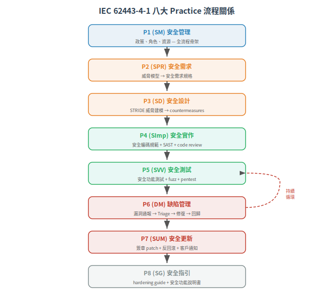
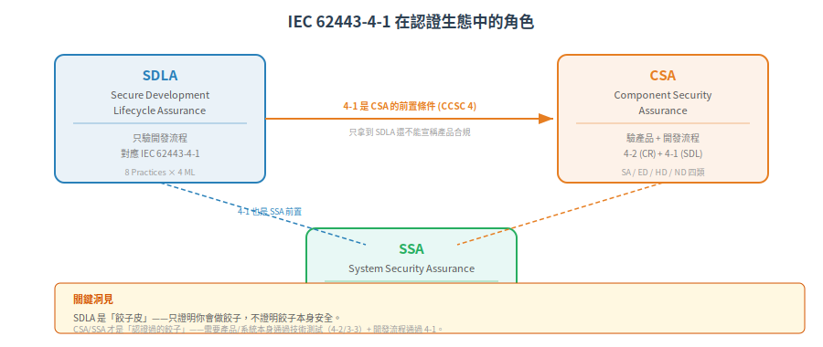

# Secure SDLC 全景 — IEC 62443-4-1 的軟體開發流程要求

IEC 62443-4-1 回答「軟體怎麼安全地做出來」——不是「product 長怎樣」（那是 4-2 的事），而是「開發流程本身有沒有內建安全」。它定義了 8 個 Practices × 4 個 Maturity Levels，讓安全從「事後補」變成「一開始就內建」。

下一篇：[→ Practice 1-2：開發管理與安全需求定義](02-security-management-requirements.md)

## 為什麼開發流程也要管？

回想第一篇講 IT vs OT 的第三條裂縫：工控產品的生命週期是 10-20 年。

這意味著：
- 你今天交付的 PLC firmware，10 年後客戶還在用
- 10 年內會出新漏洞、新協定（TLS 1.3 變 1.4）、新攻擊手法
- 如果漏洞發現了，你怎麼通知客戶？怎麼出 patch？patch 有沒有簽章？

更根本的問題：如果開發期間沒有安全紀律，你連自己產品裡用到的 open source lib 有哪些 CVE 都不知道。

IEC 62443-4-1 的答案：把安全標準化到開發流程中——從需求、設計、實作、測試、到產品生命週期結束——每一階段都有安全要求。

**CCSC 4** 把這個原則寫成鐵律：
> 組件須由符合 IEC 62443-4-1 的開發流程開發與支援。

也就是說：不只產品本身要安全（4-2），開發產品的流程也要安全（4-1）。 沒有 4-1，即使今天的產品通過 4-2 測試，明天出新 CVE 時你沒有流程去修，產品就會從合法變不合法。

## 2. 八大 Practice 全景

IEC 62443-4-1 把安全開發生命週期拆成八個 Practice，按軟體工程的階段排列：

| Practice | 本庫代號 | 中文 | 對應開發階段 | 一句話 |
|---|---|---|---|---|
| **P1** | SM | 安全管理 (Security Management) | 全流程 | 誰負責安全？流程怎麼建立、維護、改善？ |
| **P2** | SPR | 安全需求規格 (Security Requirements) | 需求分析 | 這個產品要防什麼？從 risk/threat 導出規格，不是臆想 |
| **P3** | SD | 安全設計 (Secure by Design) | 架構設計 | 威脅建模、最小攻擊面、縱深防禦——在 design 階段就做 |
| **P4** | SImp | 安全實作 (Secure Implementation) | 編碼 | 安全編碼規範、code review、禁用危險 API |
| **P5** | SVV | 安全驗證與測試 (Security V&V) | 測試 | 安全功能測試、fuzz testing、滲透測試 |
| **P6** | DM | 缺陷管理 (Defect Management) | 維護 | 漏洞通報→Triage→修復→回歸測試→發布 |
| **P7** | SUM | 安全更新管理 (Security Update Mgmt) | 發布 | 怎麼安全地出 patch、簽章驗證、回滾機制 |
| **P8** | SG | 安全指引 (Security Guidelines) | 交付 | 給客戶的 hardening guide：預設怎麼鎖、怎麼部署 |

> ⚠️ 以上「本庫代號」為本知識庫自行定義的速記代號，非 IEC 62443-4-1 官方縮寫。標準原文中以 Practice 全名及 Maturity Level 敘述為主。為避免與 FR 縮寫（IAC/UC/SI/DC/RDF/TRE/RA）混淆，P4 使用 `SImp` 而非 `SI`，P2 使用 `SPR` 而非 `SR`。

### Practice 之間的因果關係

不是線性 waterfall。 P6-P7 是持續迴圈：漏洞可能在產品生命週期的任何時間點發現（交付後十年），但修復流程應該在開發期間就已經建好。

## 3. Maturity Level (ML)：做到什麼程度算及格？

每個 Practice 按成熟度分成 ML 1-4：

| ML | 名稱 | 特徵 | 對應的組織狀態 |
|---|---|---|---|
| **ML 1** | Initial（初始） | 流程 ad hoc、無文件化或不全 | 新創或沒做過安全開發的團隊 |
| **ML 2** | Managed（已管理） | 依書面規範執行；人員有適切專業/訓練；流程可重複 | 有基本流程的團隊 |
| **ML 3** | Defined（已定義/已演練） | 流程在全組織內標準化、已演練、有證據 | 成熟的安全開發組織 |
| **ML 4** | Improving（持續改善） | 使用度量指標監控流程效能，展現持續改善 | 安全卓越中心 |

實際認證（ISASecure SDLA）中，開發組織對每個 Practice 獨立評等 ML。例如：
- P1 (SM) 可能 ML 3
- P4 (SI) 可能 ML 2
- P8 (SG) 可能 ML 1

> ML 不是「越高越好」——是「風險導向」。 一個做室內 LED 控制器的小公司要達到 ML 4 在 P2 (安全需求）太誇張（沒有完整威脅情報團隊）；但要達到 ML 2（有書面規範、可重複）是合理的。

## 4. 4-1 在認證生態中的角色

- SDLA（Secure Development Lifecycle Assurance）：獨立認證，只驗開發流程（不驗產品）
- CSA（Component Security Assurance）：認證產品 + 開發流程——產品要過 4-2，開發流程要過 4-1
- SSA（System Security Assurance）：認證系統 + 開發流程——系統要過 3-3，開發流程要過 4-1

實務上，拿到 SDLA 或 CSA 認證是向客戶證明 4-1 合規（CCSC 4）的主要方式。

## 5. 下一篇

接下來四篇依 Practice 配對展開：
- [Practice 1-2：開發管理與安全需求定義](02-security-management-requirements.md)
- [Practice 3-4：安全設計與安全實作](03-secure-design-implementation.md)
- [Practice 5-6：安全測試與漏洞管理](04-security-testing-vnv.md)
- [Practice 7-8：更新發布與安全文件化](05-update-patch-management.md)
- [Maturity Level (ML) 深度解析](06-maturity-levels.md)

---

相關：[IEC 62443-4-1 官方頁](https://webstore.iec.ch/en/publication/33615)、[ISASecure SDLA 認證](https://www.isasecure.org/en-US/Certification/IEC-62443-SDLA-Certification)

## 本文使用縮寫對照

| 縮寫 | 全稱 | 說明 |
|---|---|---|
| **CCSC** | Common Component Security Constraint | 通用組件安全約束，4-2 定義 4 條鐵律 |
| CSA | Component Security Assurance | ISASecure 組件安全認證 |
| CVE | Common Vulnerabilities and Exposures | 通用漏洞揭露編號 |
| DC | Data Confidentiality | 資料機密性 (FR4) |
| **FR** | Foundational Requirement | 基礎安全需求，IEC 62443 的核心架構，共 7 條 (FR1-7) |
| **IAC** | Identification and Authentication Control | 識別與鑑別控制 (FR1) |
| ISASecure | ISA Security Compliance Institute | ISA 資安合規協會，營運 IEC 62443 認證方案 |
| **ML** | Maturity Level | 成熟度等級，IEC 62443-4-1 對開發流程的分級 (1-4) |
| PLC | Programmable Logic Controller | 可程式邏輯控制器 |
| **RA** | Resource Availability | 資源可用性 (FR7) |
| **RDF** | Restricted Data Flow | 限制資料流 (FR5) |
| SDLA | Secure Development Lifecycle Assurance | ISASecure 安全開發流程認證 |
| SDLC | Secure Development Lifecycle | 安全開發生命週期，IEC 62443-4-1 規範 |
| SI | System Integrity | 系統完整性 (FR3) |
| **SImp** | Security Practice: Implementation | 本庫自訂代號：安全實作 (P4) |
| **SPR** | Security Practice: Requirements | 本庫自訂代號：安全需求規格 (P2) |
| **SR** | System Requirement | 系統安全需求，IEC 62443-3-3 定義 |
| SSA | System Security Assurance | ISASecure 系統安全認證 |
| TLS | Transport Layer Security | 傳輸層安全協定，加密通訊 |
| **TRE** | Timely Response to Events | 事件及時回應 (FR6) |
| **UC** | Use Control | 使用控制 (FR2) |

> 完整術語表見 [CONTEXT.md](../../CONTEXT.md)

---

## 版本資訊

- **基於標準**：IEC 62443-4-2:2019 (ED1)、IEC 62443-4-1:2018
- **認證方案**：ISASecure CSA 1.0.0
- **知識庫版本**：v0.1.0（2026-06-30）

> 詳細演進見 [CHANGELOG.md](../../CHANGELOG.md)

