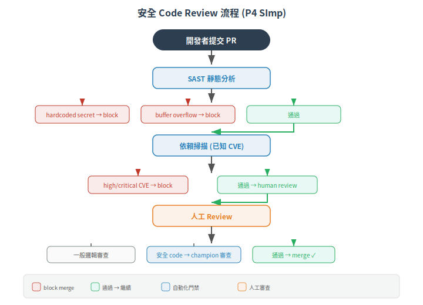

# Practice 3-4：安全設計與安全實作

> 一句話定位：P3 (SD) 是架構層——威脅建模後，在設計階段就內建防禦，不是寫完 code 才加；P4 (SImp) 是編碼層——把安全設計落實成可被 review 的程式碼。這是 SDLC 中「把安全要求轉成安全產品」的兩個核心實務。
>
> 前置：[Practice 1-2：開發管理與安全需求定義](02-security-management-requirements.md)
> 下一篇：[Practice 5-6：安全測試與漏洞管理](04-security-testing-vnv.md)

## 1. P3 (SD) — 安全設計 (Secure by Design)

### 1.1 根本問題

威脅模型告訴你「誰會從哪攻擊」，安全需求規格告訴你「要擋什麼」。但設計階段的最關鍵決定——**架構怎麼畫、模組怎麼切、邊界在哪**——直接決定了這些防禦能不能在實作層實現。

一個經典的反例：把認證邏輯寫在 HMI 前端（JavaScript），後端 API 裸奔。攻擊者繞過 HMI 直接打 API，認證形同虛設。這是設計階段的失敗——認證應該在 API gateway 層，不是靠前端。

### 1.2 Practice 3 的核心要求

| 要求 | 說明 |
|---|---|
| **威脅建模** | 在設計階段對架構做結構化威脅分析。方法：STRIDE、Attack Tree、VAST 等 |
| **安全架構設計** | 把 countermeasures 嵌入系統架構（defense-in-depth、最小攻擊面、安全分層） |
| **安全設計審查** | 設計文件由非原作者（有安全知識者）審查 |
| **安全設計原則** | 明確採用哪些設計原則（最小權限、fail-safe、economy of mechanism、complete mediation） |
| **設計文檔** | 安全設計決策與 threat model → countermeasure 對照表需文件化 |

### 1.3 STRIDE 威脅建模：工控版的應用

STRIDE 是微軟提出的六面向威脅模型，在工控場景的改編：

| 威脅類型 | 範例 | 對應 FR |
|---|---|---|
| **S**poofing（假冒） | 攻擊者偽裝成合法的 AMR 控制器發送假狀態 | FR1 (IAC) |
| **T**ampering（篡改） | 攔截並修改 OTA 韌體更新包 | FR3 (SI) |
| **R**epudiation（否認） | 操作員下達緊急停止但事後否認 | FR6 (TRE) |
| **I**nformation Disclosure（資訊洩漏） | 竊聽 MQTT 通訊取得車隊路徑 | FR4 (DC) |
| **D**enial of Service（服務阻斷） | 對 VMS 發起 SYN flood 使車隊停擺 | FR7 (RA) |
| **E**levation of Privilege（權限提升） | 一般使用者透過 API 漏洞拿到 admin token | FR2 (UC) |

> STRIDE 不是唯一的 threat modeling 方法，但它的六個面向恰好對應到 6 條 FR（FR 5 RDF 不在 STRIDE 裡，需另補）。詳見 [FR 1-7 全景](../01-foundations/04-foundational-requirements.md)。

### 1.4 設計階段要產出的安全文件

| 產出 | 內容 | 對象 |
|---|---|---|
| **Threat Model 報告** | 架構圖、data flow diagram、每個威脅的攻擊者/向量/影響 | 開發者、安全審查者 |
| **安全架構圖** | 標註信任邊界、安全控制位置（在哪層做 auth、在哪做驗章） | 架構師、開發者 |
| **安全設計決策記錄** | 「為什麼選 TLS 而非 IPsec」「為什麼 auth 在這層不在那層」 | 未來維護者（10 年後回頭看） |
| **Countermeasure Matrix** | 威脅 → 對應設計決策 → 對應測試項目（可追溯性） | 測試團隊、認證審查員 |

## 2. P4 (SImp) — 安全實作 (Secure Implementation)

### 2.1 根本問題

設計做得再好，寫 code 的人用了 `strcpy`、SQL 串接、沒有 input validation——安全設計就白做了。P4 確保「照設計寫 code」本身是安全的。

### 2.2 Practice 4 的核心要求

| 要求 | 說明 |
|---|---|
| **安全編碼規範** | 組織要有書面的安全編碼準則（語言/平台特定） |
| **安全編碼訓練** | 開發者受訓，理解其負責語言的常見弱點 |
| **Code Review** | 所有變更必須由非原作者審查，安全相關變更需要安全人員審查 |
| **靜態分析 (SAST)** | 用自動化工具掃描原始碼找安全弱點（如 buffer overflow、SQL injection、hardcoded secrets） |
| **依賴分析** | 掃描第三方 library 與 open source 元件的已知 CVE（如 `govulncheck`、`npm audit`、`OWASP Dependency-Check`） |
| **編譯器安全選項** | 啟用編譯器安全旗標（如 `-fstack-protector`、`-D_FORTIFY_SOURCE=2`、`-Wl,-z,relro`、ASLR/PIE） |

### 2.3 工控軟體的安全編碼陷阱

| 陷阱 | 說明 | 範例 |
|---|---|---|
| **C/C++ 記憶體安全** | 嵌入式 firmware 大量使用 C/C++，buffer overflow 是最常見的 RCE 入口 | `sprintf(buf, "%s", user_input);` → 改用 `snprintf` + 長度檢查 |
| **工業協定解析** | 自己 parse Modbus/DNP3/EtherNet/IP 封包時，沒有嚴格驗證長度與範圍 | 攻擊者發送畸形的 Modbus ADU，parser 崩潰 |
| **硬體資源限制** | 嵌入式裝置 RAM 128KB，不能用完整的 TLS library？ | 安全編碼規範要定義哪些 cipher 在受限硬體上可行 |
| **Debug 殘留** | JTAG/SWD 除錯埠在量產 firmware 中未禁用；debug log 印出密鑰 | 量產 build 關閉所有 debug interface + strip symbol |
| **Hardcoded Secrets** | API key、JWT secret、database password 寫死在 source code | 用環境變數、secure element、或 CI 注入 |

### 2.4 安全 code review 的實務流程

> 工控產品的特殊性：firmware 的 code review 不能只靠 SAST——許多 MCU 的 HAL 層、bootloader、中斷處理常式不在 SAST 的掃描範圍內。這些需要手動審查。

## 3. 小結

- **P3 (SD)**：設計階段就把安全架構進去——threat model → countermeasures → 安全架構文件
- **P4 (SImp)**：實作階段確保 code 不引入新漏洞——安全編碼規範 + SAST + code review + 依賴掃描
- 兩者必須接續：設計的安全決策如果編碼時被忽略（例如設計文件說要 input validation，但實作時忘記），那設計文件只是廢紙

## 4. 下一篇

> [Practice 5-6：安全測試與漏洞管理](04-security-testing-vnv.md)（撰寫中）

code 寫完了。下一步：**測試安全功能真的有效嗎？發現漏洞後怎麼處理？**

---

相關：[CONTEXT.md](../../CONTEXT.md)、[IEC 62443-4-1 官方頁](https://webstore.iec.ch/en/publication/33615)
