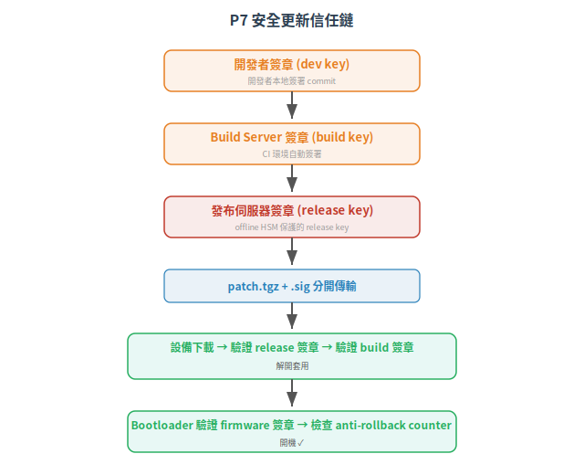

# Practice 7-8：更新發布與安全文件化

P7 (SUM) 回答 patch 怎麼安全地從你的 build server 到客戶的設備上，過程中不被篡改、不回滾到有漏洞版本；P8 (SG) 回答你交付給客戶的產品文件裡，有沒有告訴他們怎麼部署才安全——預設值夠不夠鎖、哪些 port 要關。

下一篇：[→ Maturity Level (ML) 深度解析](06-maturity-levels.md)

## 1. P7 (SUM) — 安全更新管理 (Security Update Management)

### 1.1 根本問題

P6 (DM) 修好的 patch，怎麼送到客戶的設備上？

這不是「放個下載連結就好」。工控設備的更新有獨特的約束：

| 約束 | 說明 |
|---|---|
| 不能隨便重開機 | patch 經常需要重開機才能生效，但控制系統不能停 |
| **簽章驗證** | patch 必須有數位簽章，設備才能驗證「這真的是原廠出的，不是被中間人掉包的」 |
| 反回滾 (anti-rollback) | 攻擊者不能拿一個有已知漏洞的舊版 firmware「降級」回去 |
| **斷點續傳** | 產線網路不穩，patch 下載到一半斷掉不能 brick 設備 |
| **相容性** | patch 不能讓設備跟其他周邊裝置的通訊壞掉 |

### 1.2 Practice 7 的核心要求

| 要求 | 說明 | 工控場景 |
|---|---|---|
| **安全傳輸** | patch 從發布伺服器到設備之間加密+簽章 | TLS + 簽章（patch 簽兩次：build sign + delivery sign） |
| **完整性驗證** | 設備在套用前驗證 patch 完整性與來源 | 開機時 bootloader 驗證 firmware 簽章 |
| **反回滾** | 禁止安裝小於當前版本的 patch | 硬體 monotonic counter / secure fuse |
| **更新通知** | 通知客戶有可用更新，附風險說明與 mitigation | 安全公告 (advisory) 含 CVSS、受影響版本、workaround |
| **更新文件** | 每個 patch 附 release note：修了什麼漏洞、改了什麼功能 | — |
| **回滾機制** | 更新失敗時能回到最後一個可用的狀態 | A/B partition、factory reset with security check |

### 1.3 安全更新的信任鏈

<p align="center"></p>

> **雙簽章**的分工：build key 確認「這是在我們的 CI 環境 build 的」，release key 確認「這是我們正式發布的」——如果 CI 被入侵，攻擊者簽得出 build 簽章但簽不出 release 簽章。

### 1.4 Anti-rollback 的硬體倚賴

軟體層的 anti-rollback（在 flash 裡記一個版本號）可以被攻擊者改掉。真正的 anti-rollback 需要硬體支援：

- Monotonic counter in secure element：每次更新遞增，硬體保證只能增加不能減少
- eFuse：每次更新燒一根 fuse（有次數上限，僅適用於 lifecycle-changing upgrades）
- TrustZone/secure world counter：隔離在 TrustZone 裡的 counter，normal world code 無法修改

> 如果硬體不支援，次佳方案是讓 bootloader 驗證 firmware 的版本號簽章，拒絕 version < current。這防不住有物理存取權的攻擊者（他可以重新燒 flash），但能防遠端攻擊。

## 2. P8 (SG) — 安全指引 (Security Guidelines)

### 2.1 根本問題

你開發了一台支援 TLS + x509 認證的 PLC。客戶到手後：插電、開機、連網路、預設密碼沒改、TLS 沒開（因為他們不知道怎麼設定）。

P8 問的不是「產品能不能安全」，而是「客戶知不知道怎麼安全地用它」。你的文件有沒有說清楚？

### 2.2 Practice 8 的核心產出

| 文件 | 內容 | 對象 |
|---|---|---|
| Hardening Guide | 安全部署的最佳實踐：預設值列表、哪些要改、哪些 port 要關、防火牆規則建議 | 系統整合商、現場工程師 |
| 安全功能說明書 | 產品有哪些安全功能（auth、加密、稽核）、怎麼啟用、怎麼驗證它有效 | 系統整合商、安全稽核員 |
| **安全公告模板** | 當有新漏洞時，用什麼格式通知客戶 | 客戶資安窗口 |
| 退役/報廢指引 | 產品壽命結束時，如何安全抹除機密資料（金鑰、憑證、組態） | 業主 |

### 2.3 Hardening Guide 該寫什麼 — 範例大綱

```markdown
# AMR 車載控制器 v2.1 — Hardening Guide

## 出廠預設值
- 預設帳號: admin / 出廠隨機密碼印在機殼標籤上（強制首次登入修改）
- TLS: 出廠**關閉**（因為沒有客戶憑證）。部署時必須啟用
- 所有網路服務預設關閉，只開 HTTPS (443) 和 Modbus TCP (502)

## 部署前必做
1. 修改 admin 密碼
2. 匯入裝置憑證 (x509), 啟用 TLS 雙向認證
3. 設定 IP whitelist (只允許 VMS IP 連入)
4. 關閉 SSH (若部署後不需要)
5. 設定 NTP server IP（確保稽核時間正確）

## 建議
- 把此設備放在獨立的控制 VLAN（非企業 VLAN）
- 控制 VLAN 與企業網路之間放工業防火牆 + DPI
- 若使用 Modbus TCP：只開放 register range 需要的部分

## 網路需求
- TCP/443: 管理介面 (HTTPS)
- TCP/502: Modbus TCP（僅接受來自 VMS IP 的連線）
```

### 2.4 安全功能說明書 — 給稽核員看的

當客戶要證明「我用的設備滿足 IEC 62443-4-2」時，他們會來跟你要一份文件，填寫類似這樣的表格：

| FR | 本產品支援 | SL-C | 如何驗證 |
|---|---|---|---|
| FR1 (IAC) | x509 雙向認證 + admin 帳密 | 3 | 見 §3.1.2 裝置憑證安裝步驟 |
| FR2 (UC) | RBAC (operator / engineer / admin) | 2 | 見 §4.2.3 角色權限表 |
| FR3 (SI) | Secure Boot + FW 簽章驗證 | 3 | 見 §5.1 韌體更新驗證流程 |

> P8 不是「寫文件當交差了事」。它是 CCSC 2 的具體落實——當你的產品在某個 FR 只做到 SL-C 2，但客戶的 Zone 需要 SL-T 3 時，你的文件必須告訴他們如何**在系統層補償**。


- P7 (SUM)：安全更新 = 簽章 + 反回滾 + 通知 + 回滾保護。不只是放連結
- P8 (SG)：文件是產品安全的一部分——你給客戶的 hardening guide 決定了產品在現場是安全的還是裸奔的
- P8 也是 CCSC 2 的實踐工具：做不到的，寫在文件裡，讓整合商知道怎麼補

八個 Practice 說完了。最後一個問題：做到什麼程度才叫「做到」？ML 1-4 怎麼定義、怎麼評分、怎麼一步步提升？

---


## 本文使用縮寫對照

| 縮寫 | 全稱 | 說明 |
|---|---|---|
| AMR | Autonomous Mobile Robot | 自主移動機器人/搬運車 |
| **CCSC** | Common Component Security Constraint | 通用組件安全約束，4-2 定義 4 條鐵律 |
| CI | Continuous Integration | 持續整合，自動化 build/test |
| CVSS | Common Vulnerability Scoring System | 通用漏洞評分系統，0-10 分 |
| DPI | Deep Packet Inspection | 深層封包檢測，辨識應用層協定內容 |
| **FR** | Foundational Requirement | 基礎安全需求，IEC 62443 的核心架構，共 7 條 (FR1-7) |
| FW | Firmware | 韌體，嵌入式裝置上的軟體 |
| **IAC** | Identification and Authentication Control | 識別與鑑別控制 (FR1) |
| **ML** | Maturity Level | 成熟度等級，IEC 62443-4-1 對開發流程的分級 (1-4) |
| NTP | Network Time Protocol | 網路時間協定，同步設備時鐘 |
| PLC | Programmable Logic Controller | 可程式邏輯控制器 |
| RBAC | Role-Based Access Control | 基於角色的存取控制 |
| SI | System Integrity | 系統完整性 (FR3) |
| **SL** | Security Level | 安全等級，依攻擊者能力分 0-4 級 |
| **SL-C** | Capability Security Level | 能力安全等級，組件或系統能達到的安全等級 |
| **SL-T** | Target Security Level | 目標安全等級，業主經風險評估後設定 |
| TLS | Transport Layer Security | 傳輸層安全協定，加密通訊 |
| **UC** | Use Control | 使用控制 (FR2) |
| VLAN | Virtual LAN | 虛擬區域網路，邏輯隔離 |

> 完整術語表見 [CONTEXT.md](../../CONTEXT.md)

---

## 版本資訊

- **基於標準**：IEC 62443-4-2:2019 (ED1)、IEC 62443-4-1:2018
- **認證方案**：ISASecure CSA 1.0.0
- **知識庫版本**：v0.1.0（2026-06-30）

> 詳細演進見 [CHANGELOG.md](../../CHANGELOG.md)

