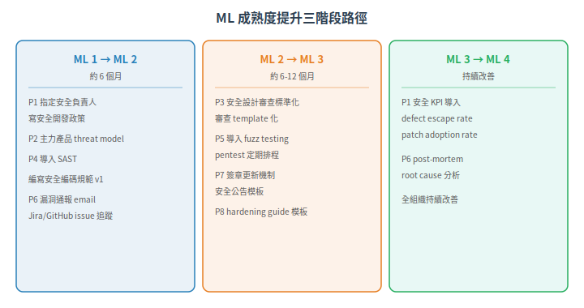

# Maturity Level (ML) 深度解析 — 從初創到持續改善

> 一句話定位：ML 是 IEC 62443-4-1 的度量尺——不只定義「要做什麼」(8 個 Practices)，更定義「做到什麼程度才算及格」。四個 ML 等級提供了一條可逐步攀登的成熟度路線，讓組織不必從零跳到完美。
>
> 前置：[八個 Practice 系列](01-secure-sdlc-overview.md)（理解每個 Practice 的內容後，才知道要評什麼）

## 1. 根本問題：有做 vs 做到好

最容易踩的坑：**把「有文件」當成「合規」。**

「我們有 threat model 文件」——但那份是兩年前寫的、沒更新、只有一頁、沒人審查過。

「我們有 code review」——但 review 只是同事看一眼按 approve，沒看安全相關的邏輯。

IEC 62443-4-1 用 Maturity Level 解決這個問題：不只是「有沒有做」，而是 **「做得有多深、多廣、多可重複、多可證明」**。

## 2. ML 1-4 的定義

四個等級不是「分數」，而是組織成熟度的四個階段：

| ML | 名稱 | 一句話 | 對應的組織狀態 |
|---|---|---|---|
| **ML 1** | Initial（初始） | 有做事，但沒文件、沒標準、無法重複 | 新創團隊、沒做過安全開發的團隊 |
| **ML 2** | Managed（已管理） | 有書面流程、人員受過訓練、流程可重複 | 有基本流程的團隊，開始建立紀律 |
| **ML 3** | Defined（已定義/已演練） | 流程在全組織標準化、已演練、有客觀證據 | 成熟的安全開發組織 |
| **ML 4** | Improving（持續改善） | 用度量指標監控流程、持續改善 | 安全卓越中心 |

### 2.1 每級的核心差異

| 面向 | ML 1 | ML 2 | ML 3 | ML 4 |
|---|---|---|---|---|
| **文件化** | 無或不全 | 有書面流程 | 標準化、已演練 | 文件+度量 |
| **可重複性** | 每次做法不同 | 同一個人能做第二次 | 不同人也做出一樣的結果 | 跨團隊、跨產品一致 |
| **證據** | 無 | 有限 | 有演練記錄 | 有度量數據 |
| **訓練** | 無要求 | 有訓練 | 訓練有記錄 | 訓練內容依度量調整 |
| **改善** | 無 | 無 | 無 | 有計劃、有數據 |

## 3. Practice × ML 矩陣：實務範例

以八個 Practice 為例，對照 ML 1-4 的樣貌：

| Practice | ML 1 | ML 2 | ML 3 | ML 4 |
|---|---|---|---|---|
| **P1 (SM)** | 有人在意安全，但沒有正式角色 | 指定安全負責人、有書面政策 | 政策全組織標準化、安全角色有備援 | 安全 KPI 監控、年度流程改善計畫 |
| **P2 (SPR)** | 開發者自己判斷要不要加安全 | 每個產品有威脅模型文件 | 威脅模型方法標準化 (STRIDE)、需求可追溯至威脅 | 威脅情報持續更新、威脅模型定期重評 |
| **P3 (SD)** | 設計時「考慮安全性」 | 有安全設計審查、產出架構圖 | 安全設計原則全組織標準化、設計審查有模板 | 安全設計決策受度量監控（例如 defect escape rate） |
| **P4 (SImp)** | 「寫 code 小心一點」 | 有安全編碼規範、靜態分析工具啟用 | 所有 CI 跑 SAST、安全相關 PR 強制安全人員審查 | 靜態分析規則庫持續改善、false positive rate 受監控 |
| **P5 (SVV)** | QA 手測 | 有安全測試計畫、fuzz testing 存在 | 安全測試全組織標準化、測試覆蓋率有記錄 | 測試有效性受監控（測試找到的 bug vs escape 到客戶的 bug） |
| **P6 (DM)** | 發現漏洞→修掉→忘了記錄 | 有漏洞追蹤系統、severity 分級 | 漏洞處置流程標準化、SLA 受監控 | Post-mortem 分析、root cause 追蹤改善 |
| **P7 (SUM)** | 放一個 zip 在官網 | 有簽章驗證、通知客戶流程 | 更新發布流程標準化、反回滾機制 | 更新成功率監控、客戶套用率追蹤 |
| **P8 (SG)** | README.txt | 有 hardening guide | Hardening guide 模板標準化、對應 CCSC 2 補償說明 | 客戶部署 feedback loop 回饋改善文件 |

## 4. ML 的評價方式

### 4.1 不是一個組織一個 ML

一個組織的 ML 是 **per-practice** 的。也就是說：

- P1 (SM) 可能 ML 3（政策建得好）
- P4 (SImp) 可能 ML 2（SAST 有但 code review 不完整）
- P8 (SG) 可能 ML 1（文件很陽春）

**沒有「這個組織是 ML 3」這種說法。** 正確的說法是：「本組織在 P1-P8 中，P1/P3/P6 達到 ML 3，其餘 ML 2」。

### 4.2 認證的最低門檻

ISASecure SDLA 認證不要求所有 Practice 到最高 ML。實務上的常見最低門檻：
- 每個 Practice 至少 ML 2（有文件、可重複）
- 某些 Practice 可能需要 ML 3（視認證等級而定）

> 具體門檻依 ISASecure 公告認證標準為準，此處僅為方向性說明。

### 4.3 ML 提升路徑建議

從零開始的團隊，建議的路徑：

## 5. ML 與 CMMI 的差異

常有混淆：IEC 62443-4-1 的 ML 4 是否等於 CMMI Level 4？

**不是。**
- CMMI 評價的是「整體軟體工程成熟度」
- IEC 62443-4-1 ML 評價的是「安全開發成熟度」
- 一個組織可以是 CMMI Level 5 但安全開發 ML 1——因為 CMMI 不管 security-specific practices
- 命名相似（都是 1-5/1-4）但評價的軸向不同

## 6. 小結

- **ML 不是分數，是階段**：ML 1 = 會做；ML 2 = 有流程；ML 3 = 標準化+演練；ML 4 = 改善中
- **per-practice 評價**：不同 Practice 可以不同 ML——誠實面對現狀比統一宣稱更重要
- **證據是關鍵**：ML 3+ 的核心區別不是「做更好」，而是「有證據證明你做到了」
- **不必從零到 ML 4**：先讓每個 Practice 到 ML 2（有書面+可重複），再挑重點提升到 ML 3

## 7. 下一篇

Phase 2 (02-sdlc/) 完成。下一篇進入 **Phase 3：組件 FR 1-7 逐條解說**（撰寫中），展開每個 FR 在軟硬體上的具體 CR 要求。

---

相關：[CONTEXT.md](../../CONTEXT.md)、[ISASecure SDLA 認證](https://www.isasecure.org/en-US/Certification/IEC-62443-SDLA-Certification)

---

## 本文使用縮寫對照

| 縮寫 | 全稱 | 說明 |
|---|---|---|
| **CCSC** | Common Component Security Constraint | 通用組件安全約束，4-2 定義 4 條鐵律 |
| **CI** | Continuous Integration | 持續整合，自動化 build/test |
| **CR** | Component Requirement | 組件安全需求，IEC 62443-4-2 定義 |
| **FR** | Foundational Requirement | 基礎安全需求，IEC 62443 的核心架構，共 7 條 (FR1-7) |
| **ISASecure** | ISA Security Compliance Institute | ISA 資安合規協會，營運 IEC 62443 認證方案 |
| **ML** | Maturity Level | 成熟度等級，IEC 62443-4-1 對開發流程的分級 (1-4) |
| **PR** | Pull Request | 拉取請求，code review 的變更提交單位 |
| **SAST** | Static Application Security Testing | 靜態應用安全測試，自動掃描原始碼找安全弱點 |
| **SDLA** | Secure Development Lifecycle Assurance | ISASecure 安全開發流程認證 |
| **SImp** | Security Practice: Implementation | 本庫自訂代號：安全實作 (P4) |
| **SPR** | Security Practice: Requirements | 本庫自訂代號：安全需求規格 (P2) |
| **STRIDE** | Spoofing/Tampering/Repudiation/InfoDisclosure/DoS/Elevation | 微軟六面向威脅建模方法 |

> 完整術語表見 [CONTEXT.md](../../CONTEXT.md)
