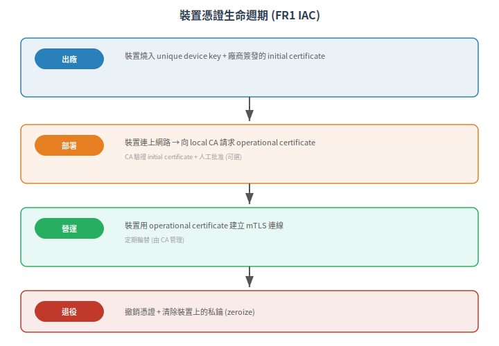

# FR 1 (IAC) — 識別與鑑別控制

> 一句話定位：FR1 回答安全的第一個問題——「你是誰？我怎麼確認？」。不只人類使用者，還有軟體程序與其他裝置。IAC 是所有其他 FR 的基礎：不知道對面是誰，後面的授權、加密、稽核全建立在沙上。
>
> 前置：[組件分類全景](01-component-classification.md)
> 下一篇：[FR 2 (UC)：使用控制與授權](03-fr2-use-control.md)

## 1. 根本問題

一條指令進來——「全線停車」「改轉速參數」「刪除搬運任務」——系統必須回答兩個問題：
1. **識別 (Identification)**：這條指令來自誰？（使用者 A？MES 系統？還是 3 號 AMR？）
2. **鑑別 (Authentication)**：這個「誰」是真的嗎？（密碼對嗎？憑證沒過期嗎？簽章有效嗎？）

**只做識別不做鑑別的荒謬**：在門上寫「我是管理員」→ 門就開了。這就是為什麼 SL 1 只要求識別、SL 2+ 要求強鑑別。

### 1.1 三種主體，三種鑑別

| 主體 | 範例 | 鑑別方式 |
|---|---|---|
| **人類使用者** | 工程師登入 HMI、操作員點擊按鈕 | 帳密、MFA、生物辨識、smart card |
| **軟體程序** | MES 自動發工單、iMEC 呼叫 VMS API | API key、service account token、OAuth client credential |
| **其他裝置** | PLC ↔ PLC、AMR 控制器 ↔ VMS | 裝置憑證 (x509)、pre-shared key (PSK)、MAC address（不夠！） |

> 工控裝置之間的鑑別是 FR1 在 OT 領域最特殊的部分——IT 通常只做 user auth，OT 必須做 device auth。

## 2. SL-C 1-4 的要求差異

> 本 FR 對應 IEC 62443-4-2 中的 **14 條 CR**（CR 1.1 – CR 1.14）。每條 CR 對特定 SL-C 等級有要求，下表為各等級的綜合摘要。CR 條號與詳細要求請參閱標準原文或 ISASecure CSA-311。
>
> [¹]: CR 條號來自 [isecwire/iec62443-audit](https://github.com/isecwire/iec62443-audit) 與 [VMware IEC 62443-4-2 Companion](https://github.com/vmware/vcf-security-and-compliance-guidelines) 交叉驗證


### 2.1 使用者鑑別

| SL | 要求 |
|---|---|
| **SL-C 1** | 唯一識別所有使用者（知道是「操作員 A」在操作），無需鑑別 |
| **SL-C 2** | 強制鑑別（帳號密碼）；預設帳密必須強制修改；帳號鎖定（失敗 N 次鎖 M 分鐘） |
| **SL-C 3** | 多因素認證 (MFA)；防 replay attack（nonce / timestamp）；session 管理 |
| **SL-C 4** | 基於硬體的鑑別 (smart card / FIDO2 token)；anti-spoofing 偵測 |

### 2.2 裝置鑑別

| SL | 要求 |
|---|---|
| **SL-C 1** | 唯一識別裝置（如 serial number / MAC），無需鑑別 |
| **SL-C 2** | 裝置之間的鑑別（PSK / 簡單憑證） |
| **SL-C 3** | x509 憑證雙向鑑別；憑證生命週期管理（發行/撤銷/輪替） |
| **SL-C 4** | 硬體安全模組 (HSM/TPM) 保護的私鑰；防偽造憑證 |

### 2.3 軟體程序鑑別

| SL | 要求 |
|---|---|
| **SL-C 1** | 識別程序來源 |
| **SL-C 2** | 服務帳號 + API key；定期輪替 |
| **SL-C 3** | 短期 token (OAuth / JWT with expiry)；client credential 雙向 TLS |
| **SL-C 4** | 硬體綁定鑑別（token 綁定特定裝置的 HSM） |

## 3. 軟體實作指南

### 3.1 預設密碼鐵則

**最常見的 IEC 62443-4-2 不合格項目**：出廠預設密碼沒改。

| 做法 | 狀態 |
|---|---|
| admin/admin，寫在說明書裡 | ❌ 不合格 |
| 每台出廠隨機密碼，印在機殼標籤上 | △ 勉強（物理接觸者看得到） |
| 首次開機強制修改密碼 | ✓ 合格 |
| 無預設密碼，首次開機要求設定 | ✓✓ 最佳 |

### 3.2 密碼策略

```
最低要求 (SL-C 2):
- 最小長度 8 字元
- 含大寫、小寫、數字、符號中至少 3 類
- 錯誤嘗試 5 次鎖 15 分鐘
- 90 天強制更換
```

### 3.3 API 認證：不要自己造輪子

| 場景 | 推薦方案 | 反模式 |
|---|---|---|
| REST API 之間呼叫 | OAuth 2.0 client credentials grant + mTLS | 自創 token 格式、JWT secret 寫死在 code |
| 裝置註冊/認證 | x509 憑證 + CA chain 驗證 | MAC address whitelist（可偽造） |
| WebSocket / MQTT | Token-based (JWT) over TLS | 明文 MQTT 無認證 |

### 3.4 裝置憑證部署流程

<p align="center"></p>

## 4. 硬體支援需求

| 硬體功能 | 對應 SL-C | 說明 |
|---|---|---|
| **Secure Element (SE)** | SL-C 3-4 | 私鑰存放在 SE 內，不可匯出；金鑰操作在 SE 內完成，軟體拿不到私鑰 |
| **TPM** | SL-C 3-4 | 平台層的信任根：儲存平台身份金鑰 (EK, AIK)、執行金鑰認證 (attestation) |
| **HSM** | SL-C 4 | 獨立的安全模組（常為 PCIe 卡或外部 module），FIPS 140-2 Level 3+ 認證 |
| **Unique Device ID** | SL-C 1+ | 硬體唯一識別符（晶片序號、fuse-based ID），用於裝置識別 |
| **PUF (Physically Unclonable Function)** | SL-C 3-4 | 用晶片製造變異產生唯一金鑰，不需儲存私鑰（無金鑰被擷取的風險） |

### 4.1 HSM vs TPM vs SE：選用決策

|  | TPM | Secure Element | External HSM |
|---|---|---|---|
| 典型介面 | LPC/SPI/I2C | I2C/SPI/SWI | PCIe/USB/Network |
| 金鑰儲存 | ✓ | ✓ | ✓ |
| 金鑰操作在內部 | ✓ | ✓ | ✓ |
| FIPS 認證 | FIPS 140-2 L2 | 視型號 | FIPS 140-2 L3 |
| 成本 | 低（$1-3） | 低（$0.3-1） | 高（$100-5000） |
| 適合場景 | 通用 PC/Server | MCU/嵌入式 | 高安全伺服器 |

> 嵌入式裝置（ED）通常選 SE over TPM——因為 SE 的 I2C 介面更容易整合進 MCU，且功耗更低。

## 5. 組件類型特化要點

| 類型 | IAC 重點 |
|---|---|
| **SA** | 使用者登入 auth、API 之間的 client credential、OAuth/JWT；倚賴 Host OS 的憑證儲存 |
| **ED** | **裝置鑑別**是核心：憑證儲存在 SE 內、mTLS；使用者登入通常透過 web-based 管理頁面 |
| **HD** | 混合：使用者登入（OS 帳號整合）+ 裝置鑑別（TPM/HSM） |
| **ND** | 管理介面的使用者 auth + 與其他 ND 之間的協定認證 (如 OSPF MD5 / BGP TCP-AO) |

## 6. 常見不合格項目（CSA 審查最常扣分的點）

1. **預設帳密沒改**（出廠 admin/admin） — 最常見的 fail
2. **JWT secret / API key 寫死在 source code** — 等同沒有鑑別
3. **MAC address 當成裝置認證** — 可偽造，不等於鑑別
4. **裝置沒有唯一識別符** — 無法追蹤哪台設備做了什麼
5. **證書私鑰存在一般 flash 裡** — 物理取出後可離線破解
6. **無帳號鎖定機制** — 暴力破解密碼無障礙

## 7. 小結

- FR1 是 FR 中最基礎的一條：不知道對面是誰，後面的授權/加密/稽核都是空的
- 三種主體（人、程序、裝置）各有不同的鑑別強度要求
- 硬體支援（SE/TPM/HSM）在 SL-C 3-4 是必須的——私鑰不能放在軟體可存取的地方
- 預設密碼是 IEC 62443 認證最常見的 fail point

## 8. 下一篇

> [FR 2 (UC)：使用控制與授權](03-fr2-use-control.md)

知道你是誰了（FR1）。下一步：**你能做什麼？**

---

相關：[CONTEXT.md](../../CONTEXT.md)、[IEC 62443-4-2 官方頁](https://webstore.iec.ch/en/publication/34421)


---

## 本文使用縮寫對照

| 縮寫 | 全稱 | 說明 |
|---|---|---|
| **AMR** | Autonomous Mobile Robot | 自主移動機器人/搬運車 |
| **CA** | Certificate Authority | 憑證授權中心，簽發數位憑證 |
| **CR** | Component Requirement | 組件安全需求，IEC 62443-4-2 定義 |
| **CSA** | Component Security Assurance | ISASecure 組件安全認證 |
| **ED** | Embedded Device | 嵌入式裝置組件 (IEC 62443-4-2 組件類型) |
| **FR** | Foundational Requirement | 基礎安全需求，IEC 62443 的核心架構，共 7 條 (FR1-7) |
| **HD** | Host Device | 主機裝置組件 (IEC 62443-4-2 組件類型) |
| **HMI** | Human-Machine Interface | 人機介面 |
| **HSM** | Hardware Security Module | 硬體安全模組，專用加密金鑰管理硬體 |
| **I2C** | Inter-Integrated Circuit | 晶片間序列通訊匯流排 |
| **IAC** | Identification and Authentication Control | 識別與鑑別控制 (FR1) |
| **ISASecure** | ISA Security Compliance Institute | ISA 資安合規協會，營運 IEC 62443 認證方案 |
| **JWT** | JSON Web Token | JSON 網頁令牌，輕量級認證 token 格式 |
| **MAC** | Mandatory Access Control | 強制存取控制，如 SELinux |
| **MCU** | Microcontroller Unit | 微控制器，嵌入式系統的核心晶片 |
| **MES** | Manufacturing Execution System | 製造執行系統，管理工單與生產排程 |
| **MFA** | Multi-Factor Authentication | 多因素認證，兩個以上鑑別因子 |
| **ND** | Network Device | 網路裝置組件 (IEC 62443-4-2 組件類型) |
| **OS** | Operating System | 作業系統 |
| **PLC** | Programmable Logic Controller | 可程式邏輯控制器 |
| **PUF** | Physically Unclonable Function | 物理不可複製函數，用晶片製造變異產生唯一金鑰 |
| **SA** | Software Application | 軟體應用組件 (IEC 62443-4-2 組件類型) |
| **SE** | Secure Element | 安全元件，晶片級金鑰儲存 (如 ATECC608) |
| **SL** | Security Level | 安全等級，依攻擊者能力分 0-4 級 |
| **SL-C** | Capability Security Level | 能力安全等級，組件或系統能達到的安全等級 |
| **SPI** | Serial Peripheral Interface | 序列週邊介面，晶片間高速通訊 |
| **TLS** | Transport Layer Security | 傳輸層安全協定，加密通訊 |
| **TPM** | Trusted Platform Module | 可信平台模組，平台身分與金鑰儲存 |
| **UC** | Use Control | 使用控制 (FR2) |
| **mTLS** | Mutual TLS | 雙向 TLS，雙方皆以憑證互相鑑別 |

> 完整術語表見 [CONTEXT.md](../../CONTEXT.md)
