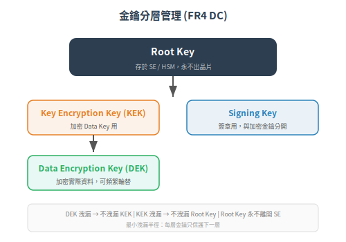

# FR 4 (DC) — 資料機密性與金鑰管理

> 一句話定位：FR4 防止機密資料被偷看——不只通訊過程中的竊聽 (data in transit)，還有設備上的儲存 (data at rest) 和使用完的殘留 (data remanence)。工控場景的機密性常被低估，但製程參數、金鑰、網路拓樸都是高價值目標。
>
> 前置：[FR 3 (SI)：系統完整性](04-fr3-system-integrity.md)
> 下一篇：[FR 5 (RDF)：限制資料流](06-fr5-restricted-data-flow.md)

## 1. 根本問題

「OT 的資料又不值錢」——這個說法是錯的。工控環境中有多種高機密性資料：

| 資料類型 | 洩漏後果 |
|---|---|
| **製程配方/參數** | 競爭者複製製程、洩漏良率關鍵參數 |
| **生產排程** | 內線交易、供應鏈攻擊前置情報 |
| **認證私鑰/憑證** | 偽裝成合法裝置（FR1 全線崩盤） |
| **網路拓樸/架構圖** | 幫攻擊者畫好攻擊路線圖，精準打擊 |
| **安全設定/稽核日誌** | 知道你在監控什麼→躲開監控 |

## 2. SL-C 1-4 的要求差異

> 本 FR 對應 IEC 62443-4-2 中的 **3 條 CR**（CR 4.1 – CR 4.3）。每條 CR 對特定 SL-C 等級有要求，下表為各等級的綜合摘要。CR 條號與詳細要求請參閱標準原文或 ISASecure CSA-311。
>
> [¹]: 同上。請注意 FR4 僅有 3 條 CR，無 CR 4.4


| SL | 傳輸中 (in transit) | 靜態 (at rest) | 金鑰管理 | 資訊殘留 |
|---|---|---|---|---|
| **SL-C 1** | 無加密要求 | 無 | — | — |
| **SL-C 2** | TLS 1.2+ (或同等強度) | — | 基本金鑰儲存 | — |
| **SL-C 3** | TLS 1.3 / IPsec | 加密儲存 (LUKS/encrypted FS) | 安全金鑰管理（輪替、撤銷） | 安全抹除 |
| **SL-C 4** | 抗量子加密 (PQ) 準備 | 硬體安全儲存 (SE/HSM) | 硬體保護的金鑰 + HSM 金鑰操作 | 自動殘留清除 |

## 3. 軟體實作指南

### 3.1 加密通訊：選對協定

| 場景 | 推薦 | 說明 |
|---|---|---|
| Web API / REST | TLS 1.3 + mTLS | 現代標準 |
| MQTT (IoT/車隊通訊) | MQTT over TLS (port 8883) | 不要用 tcp:// (port 1883 明文) |
| PLC ↔ SCADA (工業協定) | IPsec tunnel 包整段 | 舊協定 (Modbus TCP) 本身不支援加密，用 tunnel 補償 |
| 裝置註冊/bootstrap | 預先燒入 pre-shared key 或用 manufacturer cert | 初始信任建立 |
| 對內管理網路 | HTTPS (TLS 1.2+) | 至少 |

### 3.2 TLS 最低可接受設定 (SL-C 2+)

```
Protocol: TLS 1.3（若需 TLS 1.2，限於支援 AEAD 的 cipher）
Cipher suites:
  - TLS_AES_128_GCM_SHA256 (TLS 1.3)
  - TLS_AES_256_GCM_SHA384 (TLS 1.3)
禁止:
  - SSLv3, TLS 1.0, TLS 1.1
  - RC4, 3DES, CBC-mode ciphers
  - NULL ciphers
Certificate: minimum RSA 2048 / ECDSA P-256
```

### 3.3 靜態資料加密

| 儲存位置 | 加密方式 |
|---|---|
| 設定檔（含密碼/API key） | 用 application-level encryption（AES-256-GCM），金鑰從 SE 或環境變數讀取 |
| 憑證庫 | PKCS#12 / JKS，用強密碼保護 |
| 稽核日誌 | 可選加密 + 強制 HMAC（確保完整性 > 機密性） |
| 韌體 binary（在 flash 中） | 可選：但不建議 encrypt firmware（開機速度懲罰 vs 很小的機密性收益） |

### 3.4 資訊殘留清除

安全抹除敏感資料（金鑰、密碼、暫存 token）：

```
- 記憶體: memset_s / explicit_bzero（不要用 memset——compiler 會 optimize 掉）
- Flash: erase sector / wear-leveling 需多抹幾次
- 暫存檔: 寫入 random data 覆蓋 → 刪除
```

## 4. 硬體支援需求

| 硬體功能 | 說明 |
|---|---|
| **AES 硬體加速 (AES-NI / ARMv8 Crypto Extensions)** | 嵌入式裝置效能瓶頸：純軟體 AES 可能吃 30%+ CPU |
| **Hardware RNG (TRNG)** | 金鑰產生需要真隨機數，不能用 PRNG 或 time-based seed |
| **Secure Element (私鑰儲存)** | 金鑰不可匯出 SE；加解密操作在 SE 內部完成 |
| **Memory encryption** | 防止冷開機攻擊 (cold boot attack) / 物理 memory dump：Intel TME、ARM TrustZone memory encryption |

### 4.1 金鑰分層管理

<p align="center"></p>

> 分層的目的：DEK 如果洩漏（輪替頻率高），不會洩漏 Root Key（從來沒離開 SE）。攻擊者最多拿到一組 DEK 解密局部的資料。

## 5. 組件類型特化要點

| 類型 | DC 重點 |
|---|---|
| **SA** | 通訊加密（TLS）、設定檔加密、API key 管理；倚賴 OS 的憑證 store |
| **ED** | 資源受限：可能只能用 AES-128-CCM 而非 GCM（AEAD 須硬體加速）；私鑰必須存 SE |
| **HD** | TLS + IPsec + 磁碟加密 (LUKS/BitLocker)；有 TRNG/TPM |
| **ND** | 管理介面 HTTPS；ND-to-ND 協定加密（OSPFv3 IPsec、MACsec） |

## 6. 小結

- FR4 = 機密資料不被偷看：通訊加密 (TLS/IPsec) + 靜態加密 + 安全抹除
- 金鑰管理是核心：私鑰放 SE、金鑰分層 (Root→KEK→DEK)、定期輪替
- 工控的現實限制：舊工業協定不支援加密 → 用 IPsec tunnel / Conduit 補償 (CCSC 2)
- 嵌入式資源限制：AES 需要硬體加速，否則效能撐不住

## 7. 下一篇

> [FR 5 (RDF)：限制資料流](06-fr5-restricted-data-flow.md)

資料加密了（FR4）。但更大的問題是：**這些封包該不該被允許穿越 Zone 邊界？**

---

相關：[CONTEXT.md](../../CONTEXT.md)、[IEC 62443-4-2 官方頁](https://webstore.iec.ch/en/publication/34421)


---

## 本文使用縮寫對照

| 縮寫 | 全稱 | 說明 |
|---|---|---|
| **AES** | Advanced Encryption Standard | 進階加密標準，對稱式加密演算法 |
| **CCSC** | Common Component Security Constraint | 通用組件安全約束，4-2 定義 4 條鐵律 |
| **CR** | Component Requirement | 組件安全需求，IEC 62443-4-2 定義 |
| **CSA** | Component Security Assurance | ISASecure 組件安全認證 |
| **DC** | Data Confidentiality | 資料機密性 (FR4) |
| **ECDSA** | Elliptic Curve Digital Signature Algorithm | 橢圓曲線數位簽章演算法 |
| **ED** | Embedded Device | 嵌入式裝置組件 (IEC 62443-4-2 組件類型) |
| **FR** | Foundational Requirement | 基礎安全需求，IEC 62443 的核心架構，共 7 條 (FR1-7) |
| **HD** | Host Device | 主機裝置組件 (IEC 62443-4-2 組件類型) |
| **HMAC** | Hash-based Message Authentication Code | 雜湊訊息鑑別碼，驗證完整性+來源 |
| **HSM** | Hardware Security Module | 硬體安全模組，專用加密金鑰管理硬體 |
| **ISASecure** | ISA Security Compliance Institute | ISA 資安合規協會，營運 IEC 62443 認證方案 |
| **ND** | Network Device | 網路裝置組件 (IEC 62443-4-2 組件類型) |
| **OS** | Operating System | 作業系統 |
| **PLC** | Programmable Logic Controller | 可程式邏輯控制器 |
| **PRNG** | Pseudo-Random Number Generator | 偽隨機數產生器，軟體演算法 |
| **RDF** | Restricted Data Flow | 限制資料流 (FR5) |
| **RSA** | Rivest-Shamir-Adleman | 非對稱加密/簽章演算法 |
| **SA** | Software Application | 軟體應用組件 (IEC 62443-4-2 組件類型) |
| **SCADA** | Supervisory Control and Data Acquisition | 監控與資料擷取系統 |
| **SE** | Secure Element | 安全元件，晶片級金鑰儲存 (如 ATECC608) |
| **SHA** | Secure Hash Algorithm | 安全雜湊演算法，產生固定長度摘要 |
| **SI** | System Integrity | 系統完整性 (FR3) |
| **SL** | Security Level | 安全等級，依攻擊者能力分 0-4 級 |
| **SL-C** | Capability Security Level | 能力安全等級，組件或系統能達到的安全等級 |
| **TLS** | Transport Layer Security | 傳輸層安全協定，加密通訊 |
| **TPM** | Trusted Platform Module | 可信平台模組，平台身分與金鑰儲存 |
| **TRNG** | True Random Number Generator | 真隨機數產生器，硬體熵源 |
| **mTLS** | Mutual TLS | 雙向 TLS，雙方皆以憑證互相鑑別 |

> 完整術語表見 [CONTEXT.md](../../CONTEXT.md)
