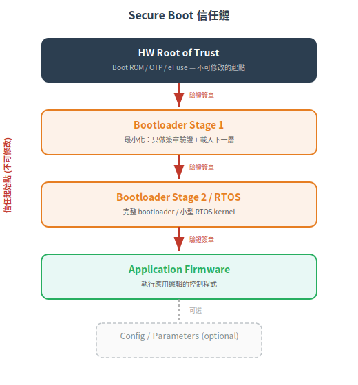

# 硬體信任根與 Secure Boot 鏈

硬體信任根 (Hardware Root of Trust) 是 FR3 (SI) 的基石——回答「信任從哪裡開始」。如果最底層的 boot code 可能被篡改，它驗證的 firmware 簽章就沒有任何意義。本篇從根本問題推導信任鏈的設計原則與實作選型。

下一篇：[→ 物理防篡改與除錯埠管理](02-physical-tamper-protection.md)

## 信任必須有起點

哲學問題：你怎麼知道你的 firmware 是原廠的？

「bootloader 驗證 firmware 簽章。」→ 誰驗證 bootloader？
「上一層 bootloader 驗證這層。」→ 誰驗證最底層？
「最底層是 ROM，不能改。」→ 這就是信任根。

信任鏈的本質：不是讓每個環節都不可破解，而是讓**第一個環節**（信任根）不可被軟體修改。之後每一層驗證下一層，形成一條「若信任根不被破壞，整條鏈都是安全的」保證。

## 2. 信任鏈的結構

 

### 2.1 信任根選型對照

| 方案 | 不可修改性 | 成本 | 說明 |
|---|---|---|---|
| Mask ROM (Boot ROM) | 最強 | 晶片設計階段 | 在晶片製造時就 hard-wired，物理上不可修改。MCU 常見 |
| OTP / eFuse | ☆ 強 | 低 | 一次性寫入，之後只能讀。存 public key hash |
| Locked flash sector | ☆☆ 弱 | 無 | 靠 flash controller 的 lock bit——攻擊者可用硬體手法繞過 |
| External secure EEPROM | ☆ 中 | 低 | 獨立晶片，但 I2C bus 上可被中間人攻擊 |

> 實務建議：SL-C 3+ 必須用 Mask ROM 或 OTP 存放 root public key hash。Locked flash 只適用於 SL-C 2 以下。

### 2.2 為什麼信任根不能只靠「寫保護」

Flash 的 lock bit 是軟體設定的——攻擊者若能拿到 code execution（例如透過 buffer overflow），可以解鎖 flash 再修改。OTP 的差異：它物理上不能再寫入。

## 3. 信任根的公鑰管理

### 3.1 公鑰儲存位置

| 儲存位置 | 存的內容 | 說明 |
|---|---|---|
| Boot ROM | Immutable boot code + Public key hash (SHA-256) | 不可修改的 boot 邏輯 |
| OTP / eFuse | Public key hash | 不存 public key 本身，省空間 |
| Bootloader (flash) | Root public key 完整內容 | 用 OTP 中的 hash 驗證它沒被改 |

> 為什麼不直接把 public key 放在 OTP？OTP 空間貴（幾百 bytes）。存 32-byte hash 即可——bootloader 載入 public key 後，boot ROM 計算 hash 比對 OTP 中的值，確認 public key 沒被改。

### 3.2 金鑰分級

## 4. Secure Boot 實作流程

### 4.1 開機流程（以 ARM TrustZone 為例）

1. CPU reset → 執行 Boot ROM (fixed address)
2. Boot ROM: 從 OTP 讀出 root_pk_hash
3. Boot ROM: 載入 Bootloader S1 binary + public key + signature
4. Boot ROM: Hash(pk) == root_pk_hash? → Yes
5. Boot ROM: Verify(BL_S1, signature, pk) → 合法?
6. Boot ROM: 若驗證失敗 → 不開機 / 進 recovery
7. Boot ROM: 若驗證成功 → 跳轉至 Bootloader S1
8. Bootloader S1: 重複上述流程驗證 BL S2
9. ... → 最後驗證 Application FW
10. Application FW 開始執行

### 4.2 驗證失敗的處理

| 策略 | 說明 | 適用場景 |
|---|---|---|
| 不開機 (hard fail) | 拒絕開機，裝置不回應 | 高安全場景（SIS, 安全 PLC） |
| 進 Recovery Mode | 進入最小化恢復模式，只接受 signed recovery image | 可更新的裝置 |
| **降級運行** | 以最後一個驗證成功的版本開機 (A/B partition) | 更新失敗時自動回滾 |

## 5. 軟體層的輔助機制

| 機制 | 說明 |
|---|---|
| A/B partition | 兩個 firmware slot。更新寫入 inactive slot，開機時切換。更新失敗自動回滾 |
| dm-verity (Linux) | block-level 完整性驗證：每個 block 有 hash tree，kernel 讀取時即時驗證 |
| IMA (Integrity Measurement Architecture) | Linux kernel 的 runtime integrity：記錄所有執行的 binary hash，供遠端驗證 (remote attestation) |
| FSBL / SPL | U-Boot 的兩階段設計：SPL 是精簡的 first-stage loader（loads into SRAM） |

## 6. 實體攻擊考量

軟體 Secure Boot 防不了以下攻擊：
- JTAG/SWD dump：直接用除錯介面讀出 firmware → 見 [下一篇](02-physical-tamper-protection.md)
- Flash chip desolder：把 flash 晶片解焊，用外部 programmer 改內容 → 外部 secure flash (authenticated flash) 可防
- Glitching：用電壓/時脈異常觸發 boot ROM 跳過簽章驗證 → 需要晶片級的 glitch detection

> 這些要用物理防護（下一篇）解決，不是單純軟體簽章能擋的。

- 信任必須有物理起點：Mask ROM / OTP（不是 lock bit）
- 信任鏈 = ROM → BL1 → BL2 → OS → App，每一層驗證下一層
- 公鑰管理分層：Root key (offline) → Signing key (online, rotatable) → Recovery key (offline)
- A/B partition 提供安全更新：寫入 inactive slot → 驗證 → 切換，失敗自動回滾

信任根有了（本篇）。但如果攻擊者物理接觸你的設備（打開機殼、接上 JTAG），軟體層的信任鏈怎麼保護？

---

## 本文使用縮寫對照

| 縮寫 | 全稱 | 說明 |
|---|---|---|
| **FR** | Foundational Requirement | 基礎安全需求，IEC 62443 的核心架構，共 7 條 (FR1-7) |
| FW | Firmware | 韌體，嵌入式裝置上的軟體 |
| I2C | Inter-Integrated Circuit | 晶片間序列通訊匯流排 |
| JTAG | Joint Test Action Group | 聯合測試行動組，晶片除錯介面標準 |
| MCU | Microcontroller Unit | 微控制器，嵌入式系統的核心晶片 |
| OS | Operating System | 作業系統 |
| OTP | One-Time Programmable | 一次性可程式化記憶體 (eFuse 類) |
| PLC | Programmable Logic Controller | 可程式邏輯控制器 |
| SHA | Secure Hash Algorithm | 安全雜湊演算法，產生固定長度摘要 |
| SI | System Integrity | 系統完整性 (FR3) |
| **SL** | Security Level | 安全等級，依攻擊者能力分 0-4 級 |
| **SL-C** | Capability Security Level | 能力安全等級，組件或系統能達到的安全等級 |
| SWD | Serial Wire Debug | 序列線除錯，ARM MCU 的除錯介面 |

> 完整術語表見 [CONTEXT.md](../../CONTEXT.md)
