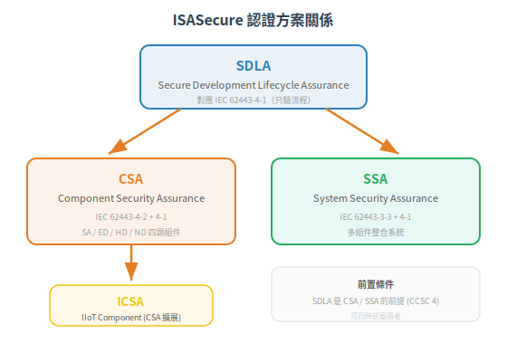
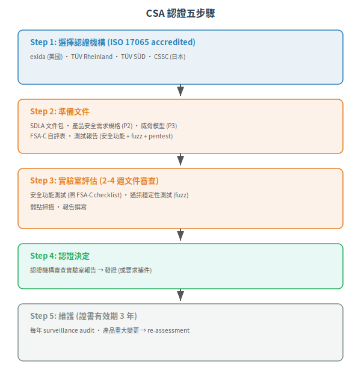
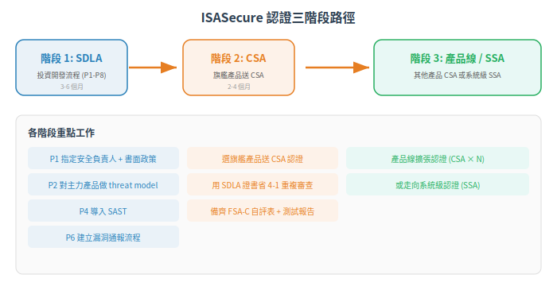

# ISASecure 認證體系 — CSA / SDLA / SSA 怎麼走

IEC 62443 是標準，ISASecure 是認證方案——回答「我的產品/開發流程/系統要怎麼向客戶證明合規」。本篇說明四種認證方案的 scope、流程、角色、費用概念，以及你該從哪個方案開始。

下一篇：[→ SL 達成路徑 — 從風險評估到合規驗證的完整閉環](02-sl-achievement-path.md)

## 有標準 ≠ 有證明

「我們的產品符合 IEC 62443-4-2」——誰說的？你自己說的（self-declaration）？還是第三方驗證過？

Self-declaration 有信用問題。客戶無法判斷你的宣稱是否合理——尤其是技術深度高的標準（4-2 有破百頁的 technical requirements）。

ISASecure 是 ISA (International Society of Automation) 營運的第三方認證方案，是目前 IEC 62443 領域最具公信力的認證體系。

## 2. 四種認證方案

| 方案 | 認證對象 | 對應標準 | 一句話 |
|---|---|---|---|
| SDLA | 開發組織的流程 | IEC 62443-4-1 | 證明「你會用安全的方式開發產品」 |
| CSA | 單一組件（產品） | IEC 62443-4-2 + 4-1 | 證明「這個產品安全 + 開發流程安全」 |
| SSA | 系統（多組件整合） | IEC 62443-3-3 + 4-1 | 證明「這個系統安全 + 開發流程安全」 |
| ICSA | IIoT 組件 | IEC 62443-4-2 + 4-1（IIoT 擴展） | CSA 的 IIoT 特化版 |

### 2.1 方案之間的關係

> SDLA 是 CSA 和 SSA 的**前置條件**——產品供應商必須先證明開發流程合規（SDLA），再去認證產品（CSA）。但你可以同時送審兩者。

## 3. 認證流程

### 3.1 典型 CSA 認證流程

### 3.2 時間與費用概念

> **免責聲明**：下表為方向性估算，基於業界經驗。ISASecure 官方僅公開 CSA 註冊年費（Component $1,200/年、Product Family $1,500/年），其他認證費用需向各認證機構（CB）報價取得。內部人力成本（撰寫文件、流程改造、測試準備）通常遠超認證費本身。

| 項目 | 估算範圍 | 備註 |
|---|---|---|
| SDLA 初次認證 | 3-6 個月, USD 30k-80k（僅 CB 報價，不含內部人力投入） | 組織規模、成熟度影響大 |
| CSA 單一組件 | 2-6 個月, USD 20k-60k | 組件複雜度、FR coverage 影響大 |
| SSA 系統認證 | 4-9 個月, USD 50k-150k | 系統規模、整合複雜度 |
| 年度維護費 | ~USD 5k-20k/year | 含 surveillance audit |

### 3.3 ISASecure 認可之認證機構 (CB)

> ISASecure 認證由通過 ISO/IEC 17065 認證的認證機構執行。具體名單可能變動，建議查 isaseseure.org 官方最新公告。

| 認證機構 | 國家/地區 |
|---|---|
| Bureau Veritas | 法國/全球 |
| exida | 美國 |
| Intertek | 全球 |
| SGS-TÜV Saar | 德國 |
| TÜV Nord | 德國 |
| TÜV Rheinland | 德國 |
| TÜV SÜD | 德國 |
| UL | 美國/全球 |
| CSSC (Control System Security Center) | 日本 |

## 4. 從哪開始？

### 4.1 建議路徑

### 4.2 為什麼先做 SDLA？

- 一個 SDLA 證書受益全產品線：拿到 SDLA 後，每新增一個產品的 CSA 認證不必重審開發流程
- 客戶要求 4-1 的頻率最高：許多採購 RFP 寫「供應商開發流程需符合 IEC 62443-4-1」——直接引用 CCSC 4
- **內部改善優先**：沒有流程，產品認證會一直被退件（文件不全、測試不足）

## 5. 文件準備：最常被退件的點

| 退件原因 | 對應 Practice | 解法 |
|---|---|---|
| Security requirements not traceable to threats | P2 (SPR) | 建立 threat → requirement → test 可追溯矩陣 |
| Threat model too shallow | P3 (SD) | 必須完整 STRIDE 或同等方法，列出攻擊向量與對策 |
| No fuzz testing evidence | P5 (SVV) | 提供 fuzz testing 報告（工具、輸入、覆蓋率、結果） |
| Defect management process not documented | P6 (DM) | 拿出 defect tracking system 的流程文件 + 實例 |
| No hardening guide | P8 (SG) | 必須提供完整的 hardening guide |
| 自評 FSA-C 與實際測試結果矛盾 | CSA | 自評誠實為上——實驗室會複測 |

- ISASecure 是目前 IEC 62443 最具公信力的第三方認證
- SDLA → CSA → SSA 是三階段路徑，先拿 SDLA 省後續重複審查
- 時間 3-9 個月，費用 20k-150k USD（方案與產品複雜度決定）
- 最常被退件：文件與測試證據不足——不是產品沒做到，是拿不出證明

產品拿到了 CSA。但對 Asset Owner 來說，怎麼確保買回來的組件放進我的工廠後，真的達到 SL-T？

---

## 本文使用縮寫對照

| 縮寫 | 全稱 | 說明 |
|---|---|---|
| **CCSC** | Common Component Security Constraint | 通用組件安全約束，4-2 定義 4 條鐵律 |
| CSA | Component Security Assurance | ISASecure 組件安全認證 |
| **FR** | Foundational Requirement | 基礎安全需求，IEC 62443 的核心架構，共 7 條 (FR1-7) |
| FSA-C | Functional Security Assessment - Component | ISASecure CSA 的功能安全評估 |
| ICSA | IIoT Component Security Assurance | ISASecure IIoT 組件安全認證 |
| ISASecure | ISA Security Compliance Institute | ISA 資安合規協會，營運 IEC 62443 認證方案 |
| SDLA | Secure Development Lifecycle Assurance | ISASecure 安全開發流程認證 |
| SDLC | Secure Development Lifecycle | 安全開發生命週期，IEC 62443-4-1 規範 |
| **SL** | Security Level | 安全等級，依攻擊者能力分 0-4 級 |
| **SL-T** | Target Security Level | 目標安全等級，業主經風險評估後設定 |
| **SPR** | Security Practice: Requirements | 本庫自訂代號：安全需求規格 (P2) |
| SSA | System Security Assurance | ISASecure 系統安全認證 |
| STRIDE | Spoofing/Tampering/Repudiation/InfoDisclosure/DoS/Elevation | 微軟六面向威脅建模方法 |

> 完整術語表見 [CONTEXT.md](../../CONTEXT.md)

---

## 版本資訊

- **基於標準**：IEC 62443-4-2:2019 (ED1)、IEC 62443-4-1:2018
- **認證方案**：ISASecure CSA 1.0.0
- **知識庫版本**：v0.1.0（2026-06-30）

> 詳細演進見 [CHANGELOG.md](../../CHANGELOG.md)

