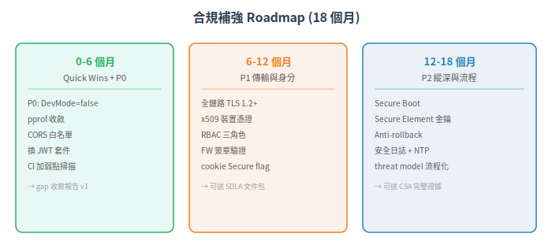

# 常見合規落差與補強策略

本篇回答實務上最常被問的問題：「我的產品要拿到 IEC 62443 認證，差在哪裡？」基於 ISASecure CSA 審查最常見的 fail points 與業界實務經驗，列出高頻 gap、補強成本排序、quick wins vs 長期 roadmap。

下一篇：[→ 與其他標準的對照](04-cross-standard-mapping.md)

## 1. Gap 全景：按 FR 分類

### 1.1 FR1 (IAC) — 最常見，修補成本低到高

| Gap | 範例 | 修正成本 | Quick Win |
|---|---|---|---|
| 預設帳密沒改 | admin/admin 出廠 | ✅ 極低 | 出廠隨機密碼 + 首次開機強制修改 |
| API 無認證 | REST API 裸奔 | ✅ 低 | 加入 token-based auth (JWT over TLS) |
| 裝置無身份 | MAC address 當 ID | ⚠ 中 | 匯入裝置憑證 (x509) |
| 無 MFA | 只有密碼 | ⚠ 中 | 加入 TOTP 或 FIDO2 |
| 私鑰存在一般 flash | 靠軟體加密 | ❌ 高 (需加 SE) | 加裝 Secure Element |

### 1.2 FR2 (UC) — 中等頻率

| Gap | 範例 | 修正成本 |
|---|---|---|
| DevMode 全繞過 | `if (devMode) return true;` | ✅ 極低 (compile out) |
| 無 RBAC | 所有人都是 admin | ⚠ 中 (需改架構) |
| 無職責分離 | 同一人可發起+核准關鍵操作 | ⚠ 中 |
| 無 session timeout | 登入後永不過期 | ✅ 低 |

### 1.3 FR3 (SI) — 高頻、高成本

| Gap | 範例 | 修正成本 |
|---|---|---|
| FW 更新無簽章 | 放個 HTTPS 下載就當安全 | ⚠ 中 (加簽章流程) |
| 無 Secure Boot | 開機不驗證 bootloader | ❌ 高 (需要 HW root of trust) |
| JTAG 未鎖 | 量產 FW 中 debug 全開 | ✅ 低 (燒 fuse) |
| 無 anti-rollback | 可降級到有漏洞的舊版 | ⚠ 中 (需 HW counter 或 SW 對策) |
| **輸入驗證不足** | Modbus parser 不檢查範圍 | ✅ 低 (加檢查條件) |
| 相依 lib 弱點未掃描 | CVE 已知但沒掃過 | ✅ 低 (govulncheck / OWASP Dependency-Check) |

### 1.4 FR4 (DC) — 中高頻、中成本

| Gap | 範例 | 修正成本 |
|---|---|---|
| HTTP 明文傳輸 | 全鏈路 http:// | ⚠ 中 (上 TLS + 憑證管理) |
| 無靜態加密 | 設定檔含密碼存入純文字 | ✅ 低 |
| 金鑰無輪替機制 | 同一支 key 用十年 | ⚠ 中 (建立 key rotation process) |
| 無 TRNG | 用 PRNG 生金鑰 (可預測) | ⚠ 中 (如無硬體 TRNG：external entropy source) |

### 1.5 FR5 (RDF) — 中頻、低到中成本

| Gap | 範例 | 修正成本 |
|---|---|---|
| 服務綁 0.0.0.0 | 全網口開放 | ✅ 極低 (改 config) |
| pprof/debug 外露 | 診斷 port 全網可達 | ✅ 極低 (關 port / 改 bind IP) |
| CORS `*` | 任何來源可存取 API | ✅ 極低 (改 config) |
| 無通訊矩陣文件 | 客戶不知道要塞什麼 port | ✅ 極低 (寫文件) |

### 1.6 FR6 (TRE) — 中低頻、低到中成本

| Gap | 範例 | 修正成本 |
|---|---|---|
| 安全事件沒記錄 | 只記 debug log | ✅ 低 (加 structured logging) |
| 無 NTP | 時間不準，日誌對不起 | ✅ 極低 (設 NTP server) |
| 日誌無完整性保護 | 攻擊者可刪日誌 | ⚠ 中 (HMAC log entries) |
| 無告警機制 | 記錄了但沒人看 | ⚠ 中 (加 SIEM/webhook alert) |

### 1.7 FR7 (RA) — 中頻、中到高成本

| Gap | 範例 | 修正成本 |
|---|---|---|
| 無 rate limiting | API 可被單 IP 打爆 | ✅ 低 (加 rate limiter) |
| 無 fail-safe | 斷訊後保持最後指令 | ⚠ 中 (design change) |
| Watchdog 單層 | 只監控 CPU 不監控應用 | ⚠ 中 (加 external watchdog) |
| 安全功能資源耗盡時降級 | auth 記憶體不足就跳過 | ⚠ 中 (改 resource mgmt 邏輯) |

## 2. 補強優先序

按「修正成本 × 覆蓋 FR 數量 × 安全影響」排序：

### P0 — 先堵大洞（成本極低、影響極大）

| # | 動作 | 成本 | 覆蓋 FR |
|---|---|---|---|
| 1 | 移除預設密碼 / JWT secret hardcode | 極低 | FR1 |
| 2 | Compile out DevMode bypass | 極低 | FR2 |
| 3 | 服務從 0.0.0.0 改綁內部 IP | 極低 | FR5 |
| 4 | 關閉 debug port / pprof 外部可達 | 極低 | FR5, FR7 |
| 5 | JTAG fuse lock（如仍未鎖） | 低 | FR3 |

### P1 — 傳輸與身分（成本中、覆蓋多 FR）

| # | 動作 | 成本 | 覆蓋 FR |
|---|---|---|---|
| 6 | 全鏈路 TLS 1.3 | 中 | FR1, FR4 |
| 7 | 匯入 x509 裝置憑證 | 中 | FR1 |
| 8 | 建立 RBAC 模型（最少 3 角色） | 中 | FR2 |
| 9 | 韌體更新加簽章驗證 | 中 | FR3 |
| 10 | 建立安全事件記錄 + NTP | 低 | FR6 |

### P2 — 縱深與流程（成本中到高、體系化）

| # | 動作 | 成本 | 覆蓋 FR |
|---|---|---|---|
| 11 | Secure Boot（選型加硬體 root of trust） | 高（下一版硬體） | FR3 |
| 12 | CI 加入靜態分析 + 相依掃描 | 中 | FR3 |
| 13 | Threat modeling 流程化 (SDLC P2-P3) | 中 | 4-1 全 |
| 14 | Fuzz testing 工業協定 | 中 | 4-1 P5 |
| 15 | 加裝 Secure Element 保護私鑰 | 中（下一版硬體） | FR1, FR4 |
| 16 | Anti-rollback 機制 | 中到高 | FR3 |

## 3. Quick Wins（今天就能做、本月見效）

1. **改預設值**：停用 DevMode、把 0.0.0.0 改成內部 IP、關 pprof、CORS 不要 `*`
2. **鎖 JTAG**：生產最後一步 → 燒 fuse
3. **排 NTP**：在內部網路佈署一台 NTP server
4. 跑一次弱點掃描：用 `govulncheck` / `trivy` / `OWASP Dependency-Check` 掃一遍，清掉 high/critical CVE
5. 寫 hardening guide 第一版：至少包含出廠預設值、必須改的設定、port list

## 4. 長期 Roadmap（6-18 個月）

IEC 62443 不是唯一的工控資安標準。跟 ISO 27001、NIST CSF、Common Criteria 的關係是什麼？什麼時候用哪個？

---

## 本文使用縮寫對照

| 縮寫 | 全稱 | 說明 |
|---|---|---|
| CI | Continuous Integration | 持續整合，自動化 build/test |
| CSA | Component Security Assurance | ISASecure 組件安全認證 |
| CSF | Cybersecurity Framework | 資安框架 (NIST) |
| CVE | Common Vulnerabilities and Exposures | 通用漏洞揭露編號 |
| DC | Data Confidentiality | 資料機密性 (FR4) |
| **FR** | Foundational Requirement | 基礎安全需求，IEC 62443 的核心架構，共 7 條 (FR1-7) |
| FW | Firmware | 韌體，嵌入式裝置上的軟體 |
| HMAC | Hash-based Message Authentication Code | 雜湊訊息鑑別碼，驗證完整性+來源 |
| **IAC** | Identification and Authentication Control | 識別與鑑別控制 (FR1) |
| ISASecure | ISA Security Compliance Institute | ISA 資安合規協會，營運 IEC 62443 認證方案 |
| JTAG | Joint Test Action Group | 聯合測試行動組，晶片除錯介面標準 |
| JWT | JSON Web Token | JSON 網頁令牌，輕量級認證 token 格式 |
| MAC | Mandatory Access Control | 強制存取控制，如 SELinux |
| MFA | Multi-Factor Authentication | 多因素認證，兩個以上鑑別因子 |
| NIST | National Institute of Standards and Technology | 美國國家標準技術研究院 |
| NTP | Network Time Protocol | 網路時間協定，同步設備時鐘 |
| PRNG | Pseudo-Random Number Generator | 偽隨機數產生器，軟體演算法 |
| **RA** | Resource Availability | 資源可用性 (FR7) |
| RBAC | Role-Based Access Control | 基於角色的存取控制 |
| **RDF** | Restricted Data Flow | 限制資料流 (FR5) |
| SDLC | Secure Development Lifecycle | 安全開發生命週期，IEC 62443-4-1 規範 |
| SE | Secure Element | 安全元件，晶片級金鑰儲存 (如 ATECC608) |
| SI | System Integrity | 系統完整性 (FR3) |
| SIEM | Security Information and Event Management | 資安資訊與事件管理系統 |
| **SL** | Security Level | 安全等級，依攻擊者能力分 0-4 級 |
| TLS | Transport Layer Security | 傳輸層安全協定，加密通訊 |
| **TRE** | Timely Response to Events | 事件及時回應 (FR6) |
| TRNG | True Random Number Generator | 真隨機數產生器，硬體熵源 |
| **UC** | Use Control | 使用控制 (FR2) |

> 完整術語表見 [CONTEXT.md](../../CONTEXT.md)
