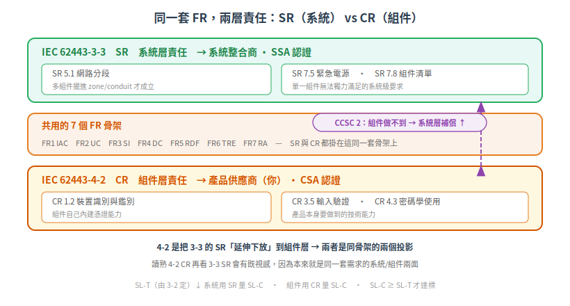
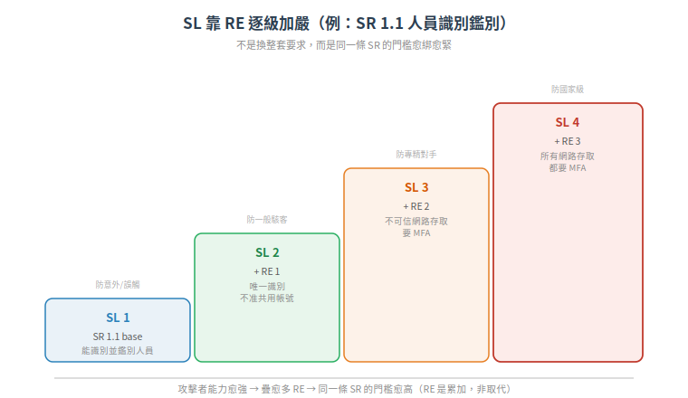

# 系統安全要求 SR — 4-2 的系統層孿生兄弟（IEC 62443-3-3:2013）

你熟的 [4-2 是「組件」的 CR](../03-component-fr/README.md)。但一個組件不會單獨存在——它被裝進一個由很多組件整合起來的**系統**。系統這一層有沒有安全要求？有，就是 IEC 62443-3-3 的 **SR（System Requirement，系統安全需求）**。

而且你會發現：SR 跟 CR 長得幾乎一樣。這不是巧合，是刻意的。這篇講清楚兩者的關係，並給你完整的 51 條 SR 對照。

> 本篇屬[延伸章節](README.md)，上游是 [3-2 風險評估](02-risk-assessment-3-2.md)（定出 SL-T），下游對應你熟的 [4-2 CR](../03-component-fr/README.md)。

## 根本問題:為什麼同一個 FR 要在兩層各寫一遍?

先看一個具體例子。FR5（限制資料流）底下有一條 **SR 5.1 網路分段（Network segmentation）**。

問：這條要求，一台 PLC 自己能滿足嗎？

**不能。** 「把控制網跟辦公網切開」是一件**要好幾個組件擺進正確的架構**才成立的事——交換器要支援 VLAN、防火牆要設規則、網段要規劃。單一 PLC 再厲害，也無法「自己一台就完成網路分段」。這是**系統層的責任**。

再看另一條：FR1 的 **CR 1.2 裝置識別與鑑別**——「這台裝置要能用憑證證明自己是誰」。這件事誰負責？**組件自己**。你不能指望系統幫一台不支援憑證的 PLC 生出身分能力來。

所以答案浮現了：**同一個安全目標（FR），有些部分只能由系統整合來實現，有些部分只能內建在組件裡。** 硬把它們寫在一起，責任就糊了。IEC 62443 的解法是切成兩本：

| | IEC 62443-3-3 | IEC 62443-4-2 |
|---|---|---|
| 單位 | **SR**（System Requirement） | **CR**（Component Requirement） |
| 對象 | 整合後的 IACS 系統 | 單一組件（PLC/HMI/嵌入式裝置…） |
| 認證 | ISASecure **SSA** | ISASecure **CSA** |
| 誰負責 | 系統整合商 | 產品供應商（**你**） |
| 骨架 | 完全相同的 7 個 FR | 完全相同的 7 個 FR |

4-2 的原文講得很白：它「把 3-3 定義的 SR 與 RE **延伸（extends）** 成一系列 CR」。也就是說——**3-3 是母體，4-2 是把它下放到組件層的特化版。** 你讀 4-2 CR 讀得很熟，回頭看 3-3 SR 會有強烈既視感，因為它們本來就是同一套骨架的兩個投影。

而兩層之間的縫，用 [CCSC 2 補償](../03-component-fr/01-component-classification.md) 縫起來：組件做不到的技術需求，可以由系統層補上（但必須寫明）。這正是「兩層責任切分」的收尾機制。

## 完整 51 條 SR 對照（依 7 個 FR）

3-3 在 7 個 FR 骨架下定義 **51 條基礎 SR**（加上 RE 展開後約 100+ 個控制項）。這張表是你把系統需求接回組件需求時的對照地圖：

### FR1 識別與鑑別控制 (IAC) — 13 條
| SR | 標題 |
|---|---|
| SR 1.1 | Human user identification and authentication（人員識別與鑑別） |
| SR 1.2 | Software process and device identification and authentication（程序與裝置識別鑑別） |
| SR 1.3 | Account management（帳號管理） |
| SR 1.4 | Identifier management（識別碼管理） |
| SR 1.5 | Authenticator management（鑑別憑證管理） |
| SR 1.6 | Wireless access management（無線存取管理） |
| SR 1.7 | Strength of password-based authentication（密碼強度） |
| SR 1.8 | Public key infrastructure (PKI) certificates（PKI 憑證） |
| SR 1.9 | Strength of public key authentication（公鑰鑑別強度） |
| SR 1.10 | Authenticator feedback（鑑別回饋） |
| SR 1.11 | Unsuccessful login attempts（登入失敗處理） |
| SR 1.12 | System use notification（使用通知橫幅） |
| SR 1.13 | Access via untrusted networks（經不可信網路存取） |

### FR2 使用控制 (UC) — 12 條
| SR | 標題 |
|---|---|
| SR 2.1 | Authorization enforcement（授權強制） |
| SR 2.2 | Wireless use control（無線使用控制） |
| SR 2.3 | Use control for portable and mobile devices（可攜/行動裝置使用控制） |
| SR 2.4 | Mobile code（行動程式碼） |
| SR 2.5 | Session lock（工作階段鎖定） |
| SR 2.6 | Remote session termination（遠端工作階段終止） |
| SR 2.7 | Concurrent session control（並行工作階段控制） |
| SR 2.8 | Auditable events（可稽核事件） |
| SR 2.9 | Audit storage capacity（稽核儲存容量） |
| SR 2.10 | Response to audit processing failures（稽核處理失敗回應） |
| SR 2.11 | Timestamps（時間戳） |
| SR 2.12 | Non-repudiation（不可否認性） |

### FR3 系統完整性 (SI) — 9 條
| SR | 標題 |
|---|---|
| SR 3.1 | Communication integrity（通訊完整性） |
| SR 3.2 | Malicious code protection（惡意程式碼防護） |
| SR 3.3 | Security functionality verification（安全功能驗證） |
| SR 3.4 | Software and information integrity（軟體與資訊完整性） |
| SR 3.5 | Input validation（輸入驗證） |
| SR 3.6 | Deterministic output（確定性輸出） |
| SR 3.7 | Error handling（錯誤處理） |
| SR 3.8 | Session integrity（工作階段完整性） |
| SR 3.9 | Protection of audit information（稽核資訊保護） |

### FR4 資料機密性 (DC) — 3 條
| SR | 標題 |
|---|---|
| SR 4.1 | Information confidentiality（資訊機密性） |
| SR 4.2 | Information persistence（資訊殘留處理） |
| SR 4.3 | Use of cryptography（密碼學使用） |

### FR5 限制資料流 (RDF) — 4 條
| SR | 標題 |
|---|---|
| SR 5.1 | Network segmentation（網路分段） |
| SR 5.2 | Zone boundary protection（區域邊界防護） |
| SR 5.3 | General purpose person-to-person communication restrictions（通用人際通訊限制） |
| SR 5.4 | Application partitioning（應用分割） |

### FR6 事件及時回應 (TRE) — 2 條
| SR | 標題 |
|---|---|
| SR 6.1 | Audit log accessibility（稽核日誌可存取性） |
| SR 6.2 | Continuous monitoring（持續監控） |

### FR7 資源可用性 (RA) — 8 條
| SR | 標題 |
|---|---|
| SR 7.1 | Denial of service protection（阻斷服務防護） |
| SR 7.2 | Resource management（資源管理） |
| SR 7.3 | Control system backup（控制系統備份） |
| SR 7.4 | Control system recovery and reconstitution（復原與重建） |
| SR 7.5 | Emergency power（緊急電源） |
| SR 7.6 | Network and security configuration settings（網路與安全組態設定） |
| SR 7.7 | Least functionality（最小功能） |
| SR 7.8 | Control system component inventory（組件清單） |

> 計數核對：13+12+9+3+4+2+8 = **51 條 SR**。FR5、FR7 的「網路分段、緊急電源、組件清單」這類明顯是**系統層**才談得上的要求——對照回 4-2，你會發現組件層沒有完全對應的 CR，因為那本就不是單一組件的責任。

## SL 怎麼加上去:Requirement Enhancement (RE)

一個常見誤解是「SL 4 有一整套跟 SL 1 不同的要求」。**不是。** 機制優雅得多：

**每條基礎 SR 就是 SL 1 的基線；要往 SL 2→3→4 提升，不是換掉 SR，而是往上疊 RE（Requirement Enhancement，需求強化項）。**

以 SR 1.1（人員識別與鑑別）為例：

| 層級 | 要求 | 對應 SL |
|---|---|---|
| SR 1.1 base | 系統要能識別並鑑別所有人員 | SL 1 |
| + RE 1 | 唯一識別與鑑別（不准共用帳號） | SL 2 |
| + RE 2 | 經不可信網路存取時要**多因素鑑別 (MFA)** | SL 3 |
| + RE 3 | **所有**網路存取都要 MFA | SL 4 |

看出邏輯了嗎？防護不是「有或無」，是**同一條要求愈綁愈緊**。攻擊者愈強（SL 愈高），你就把同一個控制點的門檻往上抬。這跟 [SL 分級的威脅模型](../01-foundations/03-security-levels.md) 完全咬合：SL 2 防一般駭客、SL 3 防專精對手、SL 4 防國家級——每加一級 RE，就是多擋一層對手的能力。

> ⚠ 完整的「51 條 SR × SL 1-4 × 全部 RE」逐格分配矩陣在標準正文的 Annex A。本篇只列出結構與已查證的樣本（如 SR 1.1 的 RE 階梯），**完整逐格對照請以標準正文 Table A.x 為準**，勿把樣本外推成全部。

## 3-3 在認證裡的角色:SSA

前面說 SR 對系統、CR 對組件。落到認證：

- 你的**組件**拿 [CSA](../05-compliance/01-isasecure-certification.md)，依據 4-2 CR。
- **整合後的系統**拿 **SSA（System Security Assurance）**，依據 3-3 SR。

SSA 的功能安全評估（FSA-S）要求「涵蓋 ANSI/ISA-62443-3-3 的所有要求」，認證等級對齊 3-3 的能力安全等級，證書會列出系統內**各 security zone 各自認證到的 SL**（呼應 [3-2 的 zone 劃分](02-risk-assessment-3-2.md)）。而且能送 SSA 的系統，必須是由**已通過 SDLA 流程**開發的。2024 年 ISASecure 依 3-3 發出首批 SL 3 系統（SSA）認證（isasecure.org 公告）。

對你這個組件供應商的意義：客戶（整合商）要拿 SSA 時，會把你的 CSA 組件當積木。**你的 SL-C 標得愈清楚、補償需求寫得愈明白，客戶的 SSA 就愈好過。**

## 三個重點帶走

| # | 重點 |
|---|---|
| 1 | SR（3-3 系統層）與 CR（4-2 組件層）共用同一套 7 FR 骨架；4-2 是 3-3 下放到組件的特化版 |
| 2 | 有些要求本質是系統層（網路分段、緊急電源），組件做不到就用 CCSC 2 補償 |
| 3 | SL 靠 RE 逐級加嚴，不是換整套要求；完整矩陣在 Annex A |

---

## 本文使用縮寫對照

| 縮寫 | 全稱 | 說明 |
|---|---|---|
| CR | Component Requirement | 組件安全需求，IEC 62443-4-2 定義 |
| CCSC | Common Component Security Constraint | 通用組件安全約束，4-2 的 4 條共通約束 |
| FR | Foundational Requirement | 基礎安全需求，7 條骨架 |
| FSA-S | Functional Security Assessment - System | ISASecure SSA 的功能安全評估 |
| MFA | Multi-Factor Authentication | 多因素鑑別 |
| RE | Requirement Enhancement | 需求強化項，SL 提升時疊加 |
| SR | System Requirement | 系統安全需求，IEC 62443-3-3 定義 |
| SL-C | Capability Security Level | 能力安全等級 |
| SSA | System Security Assurance | ISASecure 系統安全認證，依據 3-3 |

> [完整術語表](../../CONTEXT.md)

---

## 版本資訊

- **基於標準**：IEC 62443-3-3:2013 (Ed.1.0)（ANSI/ISA 版技術內容相同；歐洲採納版 EN IEC 62443-3-3:2019 內文通常不變，待查證）
- **SR 條目**：51 條，來源為多權威來源交叉比對，官方正文措辭以標準本文為準
- **知識庫版本**：v0.2.0（延伸章節）

> SR 標題以二手權威來源交叉驗證整理，非官方 PDF 逐字複製；完整 SR×SL×RE 矩陣需以標準正文 Annex A 為準。詳見 [CHANGELOG.md](../../CHANGELOG.md)
