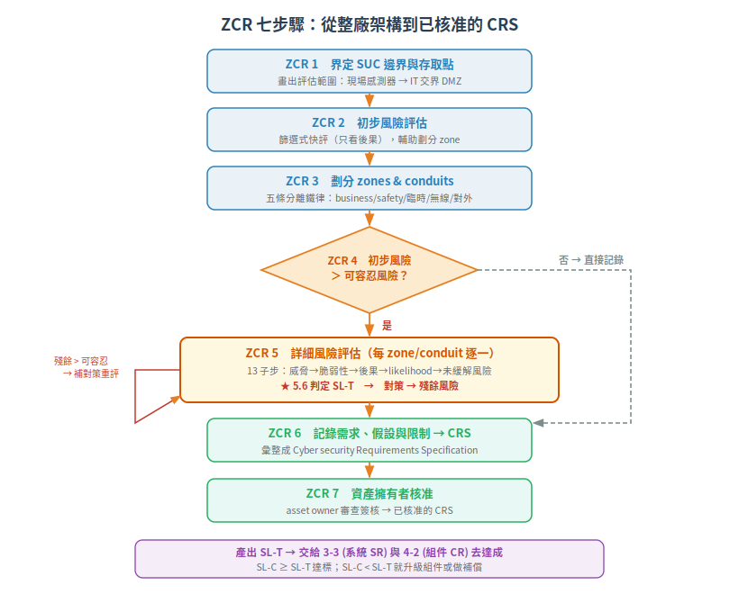
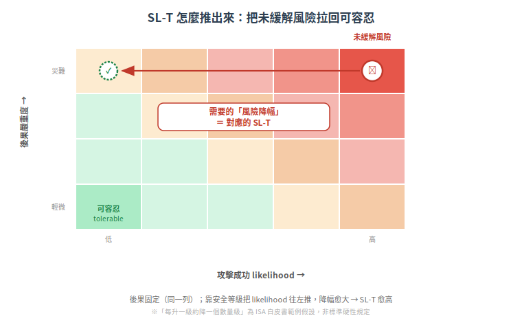

# 風險評估 ZCR — SL-T 到底從哪裡來（IEC 62443-3-2:2020）

你的組件被要求「做到 SL 3」。這個數字不是客戶拍腦袋喊的，是從一套**風險評估方法**推導出來的。搞懂這套方法，你才知道客戶為什麼這樣要求、什麼時候可以跟他談「這個 zone 其實 SL 2 就夠」。

這篇拆的就是那套方法：IEC 62443-3-2 的 **ZCR 七步驟**。

> 本篇屬[延伸章節](README.md)，是[系統要求 SR](01-system-requirements-3-3.md) 的上游——先有 3-2 定出 SL-T，才有 3-3/4-2 去滿足它。

## 根本問題：為什麼不把整廠都做到 SL 4？

因為做不起，也沒必要。

SL 每升一級，成本不是線性增加——SL 4 要防的是國家級對手（見 [SL 分級](../01-foundations/03-security-levels.md)），意味著硬體信任根、防篡改、金鑰永不出晶片、形式化驗證……把一台只是「開關風扇」的 I/O 模組做到 SL 4，錢燒光、專案死掉，而它就算被攻破也不會怎樣。

反過來，把一台「控制反應爐主閥」的 PLC 只做到 SL 1，一次意外誤觸就可能出人命。

所以核心矛盾是：**安全預算有限，但不同資產被攻破的後果天差地別。** 理性的做法只有一個——**按風險分配防護強度**。哪裡後果嚴重、哪裡容易被打，那裡就要高 SL；反之低 SL。這就是 SL-T（Target Security Level，目標安全等級）的本質：它不是技術規格，是**風險決策的產物**。

3-2 就是把這個決策做得有紀律、可稽核、可重複的方法。

## 兩個前置概念:可容忍風險 vs 殘餘風險

整套流程的判準只有一條線——**可容忍風險（tolerable risk）**：

- **可容忍風險**：業主（asset owner，嚴格說是 authority having jurisdiction，通常就是營運公司）依自己的企業風險矩陣訂的「可以接受到這裡」的門檻。這是**基線**，後面每個決策點都拿它來比。
- **未緩解風險（unmitigated risk）**：假設「什麼對策都沒有」時的風險。故意先算這個，才看得出防護到底擋掉多少。
- **殘餘風險（residual risk）**：套上對策之後，剩下的風險。

流程的骨架就是一句話：**先算沒對策時多危險 → 加對策 → 看剩多少 → 跟可容忍線比。剩的還超過線，就再加對策或接受/移轉風險。**

## ZCR 七步驟:從一張架構圖到一份核准的需求規格

ZCR = Zone and Conduit Requirements。七個步驟把「整個工廠」逐步收斂成「每個 zone 該做到 SL 幾、要滿足哪些安全需求」。

| 步驟（官方 clause） | 做什麼 | 產出 |
|---|---|---|
| **ZCR 1** 界定 SUC (4.2) | 畫出評估範圍邊界與所有存取點：從現場感測器/致動器，一路到跟 IT 交界的 DMZ，含 IIoT/雲連線 | 已文件化的 SUC 邊界與存取點 |
| **ZCR 2** 初步風險評估 (4.3) | 篩選式快評，判斷「需不需要更深入」，並幫助劃分 zone。此階段把 likelihood 簡化（只看後果） | 初步風險結果 |
| **ZCR 3** 劃分 zones & conduits (4.4) | 依風險把 SUC 切成 zone（資產群組）與 conduit（跨 zone 通訊通道） | zone/conduit 圖 |
| **ZCR 4** 風險比較 (4.5) | **決策點**：初步風險 > 可容忍風險？否 → 直接記錄；是 → 進 ZCR 5 | 決策 No/Yes |
| **ZCR 5** 詳細風險評估 (4.6) | 對每個 zone/conduit 逐一深評，定出 SL-T、算殘餘風險（13 個子步，見下） | 每 zone 的 SL-T + 殘餘風險 |
| **ZCR 6** 記錄需求、假設與限制 (4.7) | 全部匯整成 CRS（安全需求規格） | **CRS** |
| **ZCR 7** 業主核准 (4.8) | 資產擁有者審查並簽核 | 已核准的 CRS |

SUC = System under Consideration，評估目標系統（見 [Zone & Conduit](../01-foundations/02-zone-and-conduit.md)）。CRS = Cyber security Requirements Specification。

### ZCR 3 的劃分不是隨便切:五條分離鐵律

zone 劃分的原則是「同一 zone 內的資產有相近的安全需求、相近的後果、相近的信任邊界」。除了通則 ZCR 3.1「建立 zones/conduits」，3-2 再落成五條**強制分離**（clause 4.4 子項 3.2–3.6）：

| 規則 | 為什麼 |
|---|---|
| 3.2 business 與 IACS 分離 | 辦公網跟控制網不能同一區——這是 Stuxnet 之後的第一課 |
| 3.3 safety 相關資產分離 | SIS（安全儀表系統）被入侵 = 最後一道保命線失效，必須獨立 zone |
| 3.4 臨時連接裝置分離 | 工程師筆電、USB——移動的信任邊界，風險最高 |
| 3.5 無線裝置分離 | 無線是開放介質，攻擊面本質不同 |
| 3.6 經外部網路連接的裝置分離 | 任何對外連線都是一個被打的入口 |

### ZCR 5:SL-T 就在這裡誕生（13 個子步）

ZCR 5 是整套方法的心臟。對**每一個** zone/conduit 跑一遍：

| 子步 | 做什麼 |
|---|---|
| 5.1 識別威脅 | 誰會來打：國家級、心懷不滿的員工/承包商、非惡意人為錯誤、犯罪者、堅定對手 |
| 5.2 識別脆弱性 | 設計/實作/運行/管理的缺陷（吃 CVE、ICS-CERT、稽核結果） |
| 5.3 判定後果與衝擊 | **假設無任何對策**，評後果嚴重度 |
| 5.4 判定未緩解 likelihood | = 脆弱性 × 威脅代理人的技能/資源/動機 |
| 5.5 算未緩解風險 | risk = 後果 × likelihood，對照企業風險矩陣 |
| **5.6 判定 SL-T** | **把 likelihood 降到落入「可容忍風險」格所需的降幅 → 對應的安全等級就是 SL-T** |
| 5.7 未緩解風險 vs 可容忍 | 沒超過就跳過對策；超過才繼續 |
| 5.8 盤點既有對策 | 既有/已設計的對策（須符合 62443-3-3） |
| 5.9 重估 likelihood/impact | 納入對策後重新評 |
| 5.10 算殘餘風險 | 對策之後剩下的風險 |
| 5.11 殘餘風險 vs 可容忍 | 全部 ≤ 可容忍 → 收尾；否則繼續 |
| 5.12 補額外對策 | 再加對策，回圈重評（5.9→5.12） |
| 5.13 記錄並溝通結果 | 產出詳細風險評估報告 |

**SL-T 的推導邏輯（5.6）一句話**：後果嚴重度配 likelihood 得到未緩解風險，落在風險矩陣的某一格；要把它拉回「可容忍」那一格需要降多少風險，那個「降幅」就對應一個安全等級——那就是 SL-T。

> ⚠ ISA 白皮書舉例時假設「安全等級每升一級，風險約降一個數量級」，方便在矩陣上算。這是**範例假設，不是標準硬性規定**——不同企業的風險矩陣可以用更定性的方式判定。引用時別寫成鐵律。

## 定完 SL-T 之後:接回 3-3 與 4-2

3-2 的最終產出是每個 zone/conduit 的 **SL-T**。接下來這個目標分兩層去滿足（這就是你的組件登場的地方）：

- **系統層**：用 [IEC 62443-3-3](01-system-requirements-3-3.md) 的 **SR**（系統安全需求）衡量整個 zone 的 **SL-C**（能力等級）。
- **組件層**：用 [IEC 62443-4-2](../03-component-fr/README.md) 的 **CR**（組件安全需求）衡量單一裝置的 SL-C，看它放進這個 zone 撐不撐得起 SL-T。

判準很直接：**SL-C ≥ SL-T 就達標；SL-C < SL-T 就是缺口，要嘛升級組件、要嘛在系統層/conduit 做[補償對策](../03-component-fr/01-component-classification.md)（CCSC 2）。** 這些技術與組織需求最後全寫進 CRS（ZCR 6.1），成為系統詳細設計的基礎。

所以身為組件供應商，你其實站在這條鏈的末端：業主用 3-2 定出「這個 zone 要 SL 3」，然後拿著 3-3/4-2 來檢查你的產品夠不夠格。**你把 SL-C 標清楚、把補償需求寫明白，就是在幫客戶完成他的 ZCR。**

## 三個重點帶走

| # | 重點 |
|---|---|
| 1 | SL-T 不是技術規格，是**風險決策**——按「後果 × likelihood 對照可容忍風險」推出來 |
| 2 | ZCR 七步：界定 SUC → 初評 → 切 zone → 比風險 → 詳評定 SL-T → 寫 CRS → 業主核准 |
| 3 | 3-2 產出 SL-T，3-3(SR)/4-2(CR) 負責達成；SL-C < SL-T 就補組件或做補償 |

---

## 本文使用縮寫對照

| 縮寫 | 全稱 | 說明 |
|---|---|---|
| CRS | Cyber security Requirements Specification | 安全需求規格，ZCR 6 的產出 |
| CR | Component Requirement | 組件安全需求，IEC 62443-4-2 定義 |
| IACS | Industrial Automation and Control System | 工業自動化與控制系統 |
| SIS | Safety Instrumented System | 安全儀表系統，工廠最後一道保命控制 |
| SL-T | Target Security Level | 目標安全等級，ZCR 5.6 決定 |
| SL-C | Capability Security Level | 能力安全等級，組件/系統實際能達到的等級 |
| SR | System Requirement | 系統安全需求，IEC 62443-3-3 定義 |
| SUC | System under Consideration | 評估目標系統的範圍邊界 |
| ZCR | Zone and Conduit Requirements | 3-2 的七步驟風險評估方法 |

> [完整術語表](../../CONTEXT.md)

---

## 版本資訊

- **基於標準**：IEC 62443-3-2:2020 (Ed.1.0)（ANSI/ISA 版技術內容相同）
- **步驟編號**：clause 4.2–4.8 依 ANSI/ISA-62443-3-2 官方目次
- **知識庫版本**：v0.2.0（延伸章節）

> 標準本文為付費內容；本篇 ZCR 步驟標題依官方公開目次，各步 shall 條文原文措辭未逐字核對，引用前建議以標準本文為準。詳見 [CHANGELOG.md](../../CHANGELOG.md)
