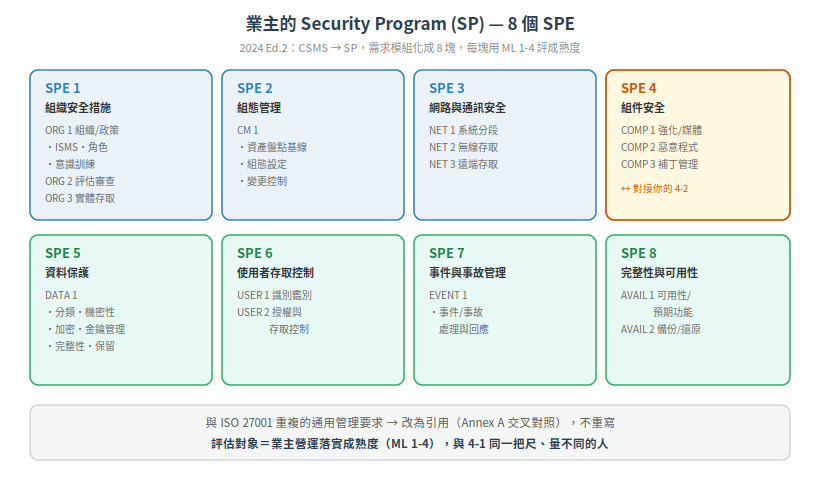

# 業主安全計畫 — 買你產品的人，自己要守什麼（IEC 62443-2-1:2024）

你的組件做得再安全，裝進一個管理鬆散的工廠也會被繞過：預設密碼沒改、遠端桌面對外開、USB 隨便插、沒人看告警。**組件安全是必要條件，不是充分條件**——還要有人在營運端把安全「管起來」。

管起來這件事，就是資產擁有者（asset owner）的責任，規範在 IEC 62443-2-1。2024 年它做了 Edition 2 大改版。這篇講它管什麼、2024 改了什麼，以及身為供應商你為什麼該懂它。

> 本篇屬[延伸章節](README.md)。2-1 是業主視角，與你的 [4-1/4-2](../03-component-fr/README.md) 產品視角互補——你的客戶用 2-1 這套框架來評估要不要買你、怎麼用你。

## 定位:工控版的 ISMS

2-1 是「資產擁有者的 IACS 安全管理計畫（Security Program, SP）要求」——本質是**工控版的 ISMS**（資訊安全管理系統，如 ISO 27001 那套）。它管的不是某個技術控制，是**整個組織怎麼治理工控資安**：政策、角色、風險、資產、存取、事件回應、營運維護。

和 [ISO 27001](../05-compliance/04-cross-standard-mapping.md) 的關係是「特化 + 對接」：2-1 不重寫 ISO 27001 已經寫好的通用管理要求，而是**假設你已經有（或應該有）一套 ISMS**，再補上工控特有的部分。

## 2024 Edition 2 的三大改版

IEC 62443-2-1:2024 前言明列三項「重大技術變更」（相對 2010 舊版）：

**① 需求重整為 SPEs（Security Program Elements，安全計畫要素）**
舊版的核心術語是 **CSMS（Cyber Security Management System）**；新版改叫 **SP（Security Program）**，並把需求**模組化**成 8 個 SPE。SP 的定義：「用來實作 IACS 資安的一套管理系統」。

**② 移除與 ISMS/ISO 27001 重複的要求**
舊版有不少要求跟 ISO 27001 撞車。新版把重複的部分**改為引用**——Annex A 直接放 ISO/IEC 27001 的交叉對照表（甚至也對照 2-4、3-3、4-2 與 NIST CSF），並在 ORG 1.1 設一條「你要有 ISMS」的需求，把 ISO 27001 當前提接上去，不重寫。

**③ 新增 maturity model（成熟度模型）**
每條需求現在可以用**成熟度等級**來評估落實程度（§4.2 有 ML 定義表）。這讓「業主到底做到什麼程度」變得可量測、可稽核。

## 8 個 SPE:業主要管的八塊

以下是 2-1:2024 官方目次的 8 個 SPE 及其主要 element（取自 IEC 官方預覽目次）：

| SPE | 名稱 | 涵蓋（element） |
|---|---|---|
| **SPE 1** | Organizational security measures（組織安全措施） | ORG 1 組織與政策（ISMS、背景查核、角色、意識訓練、供應鏈）、ORG 2 評估與審查、ORG 3 實體存取 |
| **SPE 2** | Configuration management（組態管理） | CM 1 硬/軟體資產盤點基線、組態設定、變更控制 |
| **SPE 3** | Network and communications security（網路與通訊安全） | NET 1 系統分段、NET 2 無線存取、NET 3 遠端存取 |
| **SPE 4** | Component security（組件安全） | COMP 1 組件強化與可攜媒體、COMP 2 惡意程式防護、COMP 3 補丁管理 |
| **SPE 5** | Protection of data（資料保護） | DATA 1 分類、機密性、加密機制、金鑰管理、完整性、保留政策 |
| **SPE 6** | User access control（使用者存取控制） | USER 1 識別與鑑別、USER 2 授權與存取控制 |
| **SPE 7** | Event and incident management（事件與事故管理） | EVENT 1 事件/事故處理與回應 |
| **SPE 8** | System integrity and availability（系統完整性與可用性） | AVAIL 1 可用性與預期功能、AVAIL 2 備份/還原/封存 |

> 注意這裡的 SPE 4「組件安全」——它談的是**業主怎麼在營運端管理組件**（強化、防毒、打補丁），跟你的 4-2「組件本身要有什麼技術能力」是**同一件事的兩端**：你把能力做進產品（4-2），業主在現場把它用對、維護好（2-1 SPE 4）。你的 [hardening guide](../02-sdlc/05-update-patch-management.md) 就是餵給業主這一塊的。

## 成熟度模型:跟 4-1 同一套 ML 1-4，評的對象不同

2-1 的成熟度模型與 [4-1 的 ML](../02-sdlc/06-maturity-levels.md) 是**同一套四級 CMMI 衍生模型**：

| ML | 名稱 | 精神 |
|---|---|---|
| ML 1 | Initial | 臨時、靠個人 |
| ML 2 | Managed | 有流程、可重複 |
| ML 3 | Defined | 制度化、全組織一致 |
| ML 4 | Improving | 量測並持續改善 |

**共通**：都評「流程成熟度」而非技術強度。**差異**：4-1 評的是**你（供應商）的開發流程**；2-1 評的是**業主營運期把各 SP 需求落實的成熟度**。同一把尺，量不同的人。

> ⚠ 2-1 §4.2 的 ML 各級**逐字定義**在付費正文內，本篇 ML 名稱借自 4-1 與業界資料，是否與 2-1 正文完全同字待查證。另有二手來源誤植為 5 級（混入 CMMI 原生 5 級）——官方是 **4 級**。

## 角色定位:業主 2-1、服務商 2-4、供應商 4-1/4-2

2-1 §4.1 的角色圖講得很清楚，三方各司其職：

| 角色 | 用哪本 | 做什麼 |
|---|---|---|
| **資產擁有者**（含 operator） | **2-1** | 營運端的安全治理（本篇） |
| 服務商 / 整合商 | 2-4 | 提供安全相關服務能力 |
| 產品供應商（**你**） | 4-1 + 4-2 | 安全地開發 + 組件技術能力 |

而且 2-1 明講：業主的需求「常需要服務商與產品供應商的支援」——所以它**引用** 2-4（服務商能力）與 4-2（產品技術能力）。換句話說，**你的 4-2 CSA 認證，正是業主 2-1 計畫裡「組件安全」那塊的現成證據。** 你把 SL-C 標清楚，就是在幫客戶填他的 2-1。

## 往上接:2-1 的 ML 怎麼變成 2-2 的評分

還記得[家族圖](../01-foundations/01-iec62443-overview.md)裡制定中的 **2-2（Security Protection Rating / Scheme）**嗎？它就是把 **2-1 的成熟度（ML）** 和 **3-3/4-2 的技術等級（SL）** 兩個維度**綜合成一個對「整廠營運期防護程度」的評分**（Protection Level / SPR）。

邏輯很直覺：**光有強技術（高 SL）但管理鬆散（低 ML），整體防護還是弱；反之亦然。** 2-2 就是要同時把「技術面」與「管理面」納入考量，而不是只看其中一邊。

> ⚠ exida 等來源提醒：現行標準中 ML 與 SL **並無直接數學對應**，2-2 是把兩者**並列考量**而非相乘。SPR vs PL 的主詞、2-2 的最終型態（PAS/IS）以官方 2-2 正文為準（待查證）。也留意本庫 SPR 有[另一自訂含義](../../CONTEXT.md)（4-1 的 P2），勿混淆。

## 三個重點帶走

| # | 重點 |
|---|---|
| 1 | 2-1 是業主的工控版 ISMS；2024 Ed.2 三大改：CSMS→SP/8 個 SPE、去 ISO 27001 重複、加成熟度模型 |
| 2 | 成熟度用跟 4-1 同一套 ML 1-4，但評的是業主營運落實，不是供應商開發 |
| 3 | 你的 4-2 CSA 是業主 2-1「組件安全」的現成證據；ML(2-1) 與 SL(4-2/3-3) 綜合成 2-2 的防護評分 |

---

## 本文使用縮寫對照

| 縮寫 | 全稱 | 說明 |
|---|---|---|
| CSMS | Cyber Security Management System | 2010 舊版術語，2024 改為 SP |
| ISMS | Information Security Management System | 資訊安全管理系統（如 ISO 27001） |
| ML | Maturity Level | 成熟度等級，1-4 |
| SP | Security Program | 安全計畫，2-1:2024 的核心 |
| SPE | Security Program Element | 安全計畫要素，2-1 的 8 個模組 |
| SPR / PL | Security Protection Rating / Protection Level | 2-2 的防護評分（ML × SL） |
| SL | Security Level | 安全等級（技術面） |

> [完整術語表](../../CONTEXT.md)

---

## 版本資訊

- **基於標準**：IEC 62443-2-1:2024 (Ed.2.0，2024-08)；ANSI/ISA 版 2025-01
- **SPE 清單**：取自 IEC 官方預覽目次（結構可靠）；各需求逐條文字在付費正文
- **知識庫版本**：v0.2.0（延伸章節）

> SPE 目次結構已由 IEC 官方預覽 PDF 查證；ML 逐字定義、Annex A 對照明細在付費全文，未逐字核對。詳見 [CHANGELOG.md](../../CHANGELOG.md)
