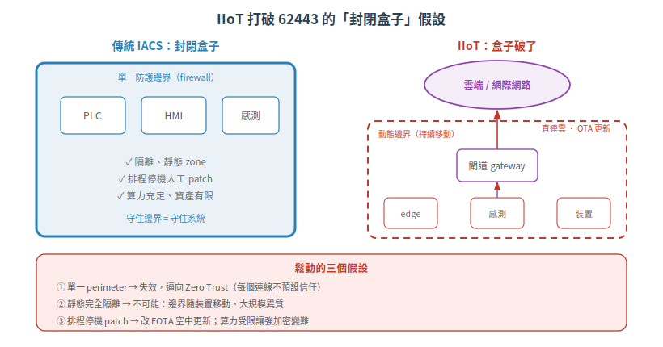

# IIoT 應用 — 當組件直連雲，62443 的假設開始鬆動（IEC PAS 62443-1-6:2025）

前面整套 62443 有幾個藏在底下的假設：工控網是**封閉**的、zone 邊界是**靜態**的、補丁是**排程停機**時手動上的。這些假設在傳統現場成立。但當你的組件變成一台**直連雲端**的 IIoT 裝置——每個假設都開始鬆動。

IEC 在 2025 年底發了一份專門處理這件事的文件：**PAS 62443-1-6**。這篇講它為什麼存在、鬆動了哪些假設，以及對做 IIoT 裝置的你意味著什麼。

> 本篇屬[延伸章節](README.md)。因 1-6 為付費 PAS，本篇以**已查證的定位與範圍**為主，條文級細節標「待查證」。

## 先看型態:為什麼是 PAS，不是正式標準?

1-6 的全名是《Application of the 62443 series to the Industrial Internet of Things (IIoT)》，2025-12-19 發布，**型態是 PAS（Publicly Available Specification，公開可用規範）**，35 頁，IEC TC 65 委員會。

PAS 不是正式國際標準（IS），它是一條**快速通道**：

| | 正式標準 IS | PAS |
|---|---|---|
| 開發時程 | 數年、需高度共識 | 可短至約 8 個月 |
| 核准門檻 | 較高共識 | 委員會參與會員簡單多數 |
| 壽命 | 長期維護 | **有時限**：數年後需複審，不轉正式版就撤回 |
| 用途 | 成熟、穩定的主題 | 技術演進快、需先給指引的領域 |

為什麼 IIoT 要走 PAS？因為 **IIoT 技術跑得太快，而 62443 各部的正式改版還沒追上。** 與其等完整共識流程跑完（那要好幾年），不如先發一份 PAS 把指引落地。這正是柵欄背後的第一性原理：**在快速演進的領域，「先有可用指引」比「等一份完美標準」更重要。** 代價是 PAS 有時限（ISO/IEC 通則為最長約 6 年、期間須複審），屆時要嘛轉正式 IS、要嘛更新或撤回。

> ⚠ 這份 1-6 的確切撤回/複審期限請以 IEC 對該 PAS 的官方標示為準（待查證）。

> IEC 摘要提到「62443 起草委員會正在改版部分標準以納入 IIoT 等新興技術」——暗示但未承諾 1-6 會轉正式 IS（待查證）。另註：Wikipedia 仍把 1-6 列為「制定中」，那是過時資訊，以 IEC Webstore 已發布事實為準。

## 根本問題:IIoT 讓 62443 的哪些假設鬆動?

把傳統 IACS 跟 IIoT 並排，就看得出裂縫在哪：

| 面向 | 傳統 IACS（封閉現場） | IIoT | 鬆動了什麼假設 |
|---|---|---|---|
| 網路暴露 | 隔離 OT 網、單一防護邊界 | 裝置**直連雲/網際網路** | 「單一 perimeter」防護模型失效，逼向 Zero Trust |
| 邊界 | zone/conduit 靜態、可完全隔離 | 邊界持續移動 | 論文原文：「現代 IIoT 環境中**完全隔離已不可能**」 |
| 規模 | 裝置數有限、協議統一 | 大規模、多協議異質 | 資產盤點與 zone 劃分難落地 |
| 更新 | 排程維護期人工 patch | **FOTA（韌體 OTA 空中更新）** | 「排程停機」的補丁模型不適合動態 IIoT |
| 資源 | 算力/供電充足 | 電池/算力受限 | 難做強加密，機密性挑戰上升 |
| 責任 | 資產擁有者全責 | 業主 / 服務商 / 雲**共擔** | 服務商角色（2-4）被放大 |

一句話：**傳統 62443 假設「你能把系統關進一個封閉盒子」。IIoT 打破了盒子。** 裝置在戶外、連著雲、大量部署、遠端更新——防護模型必須從「守邊界」轉向「每個連線都不預設信任」。

1-6 的做法**不是發明一套新要求**，而是「指出 62443 現有各部（含 [4-1](../02-sdlc/README.md)、[4-2](../03-component-fr/README.md)、[2-4](README.md)）裡，哪些要求對 IIoT 特別有用、該怎麼套」。它是一張**導覽圖**，把既有標準對準 IIoT 場景，並點名 IIoT 帶來的新通訊通道、功能重組與新資安顧慮。

> ⚠ 1-6 的**條文級內容**（IIoT 參考架構、edge/gateway/cloud 分層的具體條款、逐項威脅清單、雲側責任）在付費 PAS 內，本篇無法逐字查證，僅能確認其**存在與範圍**。細節請以標準本文為準。

## 你的 IIoT 裝置屬於哪類組件?

[4-2 把組件分四類](../03-component-fr/01-component-classification.md)：嵌入式（ED）、主機（HD）、網路（ND）、軟體（SA）。IIoT 裝置怎麼歸？

- **IIoT 感測器 / edge 裝置** → 多半是 **ED（嵌入式裝置）**；若是運算較強的 edge 主機，可能落 **HD**。
- **IIoT 閘道器（gateway）** → 依「橋接近端網路與不可信網路」的角色，對應 **ND（網路裝置）**。

> ⚠ 這是**由 4-2 通用定義推得**的對應，不是 1-6 或 ISASecure 的明文判定。實務上 ISASecure 反而把 IIoT 裝置/閘道當成**獨立產品類型**（見下），在 4-2 基礎上加減要求，而非硬塞進單一分類。1-6 本身如何歸類 gateway/edge，屬待查證。

## 認證:ISASecure ICSA

如果你做 IIoT 組件要認證，對應的是 [ISASecure](../05-compliance/01-isasecure-certification.md) 的 **ICSA（IIoT Component Security Assurance）**，2022 年納入 ISASecure，專認 **IIoT 裝置與閘道器**。

它跟一般 CSA 的關係很清楚——**站在 4-1 + 4-2 上（大部分要求相同），再加一組 IIoT 專屬準則**：

- **兩個等級**：Core（對齊 4-2 的 SL 2，另加數項識別/鑑別與攻擊監控提升到 SL 3-4）、Advanced（SL 4）。
- **IIoT 專屬調整**：新增 compartmentalization（隔離）、supplier root of trust（供應商信任根）、安全更新機制；針對不可信網路介面強化「DoS 下維持基本功能」；同時移除一些現場才有意義的要求（如密碼壽命限制、雙人核准）。

> 上述等級劃分與增/減項的**具體數量**（如各加幾項、約佔多少比例）依 ISASecure ICSA 公開規格頁，可能隨版本調整，以官方為準。

這印證了 1-6 的精神：**IIoT 不是砍掉重練，是「4-2 為主體 + 因場景調整」。**

> ⚠ 坊間常說「ICSA = 4-2 + IIoT profile」，但 ISASecure 官方文件並未用 "profile" 一詞，實質是「4-2 + 例外/增補」。措辭待查證。

## 生態位:1-6 跟其他 IIoT 框架的關係

IIoT 資安不只 62443 一家：

- **IIC IISF**（Industrial Internet Security Framework）：Industry IoT Consortium 的跨產業 IIoT 安全最佳實務框架，與 62443（管 IACS 風險的**標準**）互補——一個給框架語言、一個給可認證要求。
- **NISTIR 8259**（IoT 裝置網路安全能力）：NIST 的 IoT 裝置建議，草案**同時參照** IEC 62443-4-2 與 IIC IISF 作為來源。

這三者是「生態系互補」的關係。**1-6 是否在內文直接交叉引用 IISF / NISTIR 8259，因無法取得原文，待查證。**

## 三個重點帶走

| # | 重點 |
|---|---|
| 1 | 1-6 是 **PAS（快速通道，4 年後自動撤回）**，因 IIoT 演進快、正式改版沒追上 |
| 2 | IIoT 打破 62443「封閉盒子」假設：單一邊界→Zero Trust、靜態 zone→動態、排程 patch→OTA |
| 3 | 1-6 不發明新要求，是把既有 62443 對準 IIoT；IIoT 組件認證走 **ICSA**（4-2 + 增補） |

---

## 本文使用縮寫對照

| 縮寫 | 全稱 | 說明 |
|---|---|---|
| ED / HD / ND / SA | Embedded / Host / Network Device、Software Application | 4-2 的四類組件 |
| FOTA | Firmware Over-The-Air | 韌體空中更新 |
| ICSA | IIoT Component Security Assurance | ISASecure 的 IIoT 組件認證 |
| IIC | Industry IoT Consortium | 工業物聯網聯盟 |
| IISF | Industrial Internet Security Framework | IIC 的 IIoT 安全框架 |
| IIoT | Industrial Internet of Things | 工業物聯網 |
| PAS | Publicly Available Specification | 公開可用規範，IEC 的快速通道文件 |
| Zero Trust | — | 零信任：不預設任何連線可信，逐次驗證 |

> [完整術語表](../../CONTEXT.md)

---

## 版本資訊

- **基於標準**：IEC PAS 62443-1-6:2025 (Ed.1.0，2025-12-19，publication 102885)
- **認證**：ISASecure ICSA（IIoT 組件）
- **知識庫版本**：v0.2.0（延伸章節）

> 1-6 為付費 PAS，本篇條文級細節（IIoT 架構、分層條款、威脅清單）未能逐字查證，僅確認存在與範圍；IIoT vs IACS 差異引自 MDPI/PMC 論文與 ISASecure ICSA 公開頁。詳見 [CHANGELOG.md](../../CHANGELOG.md)
